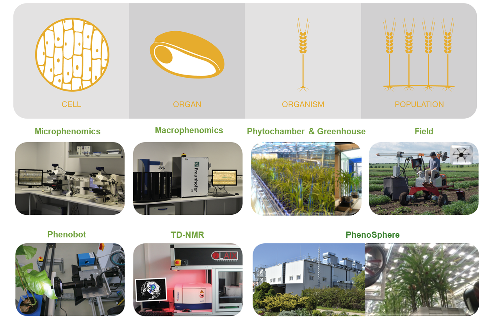
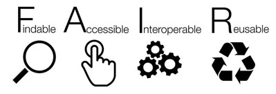
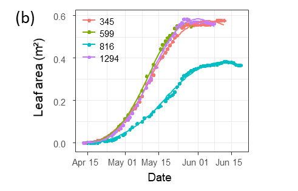
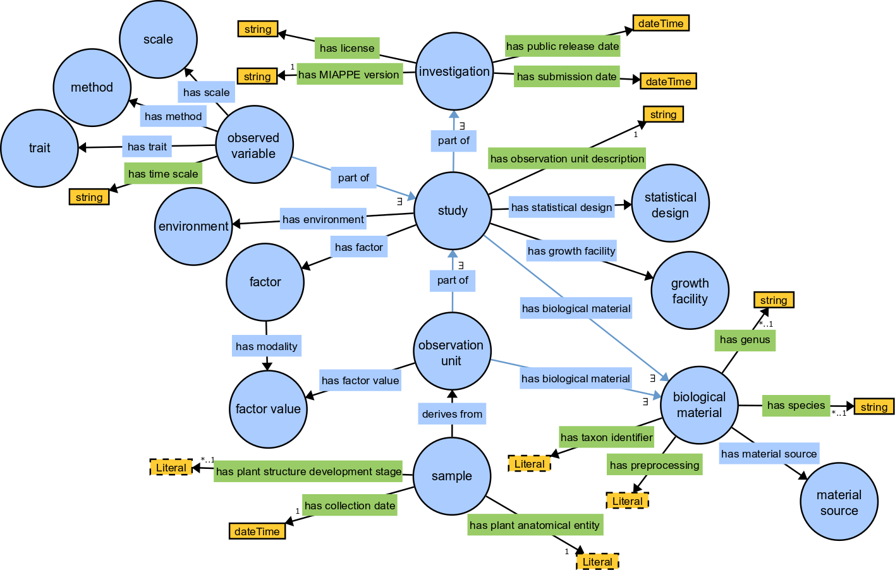
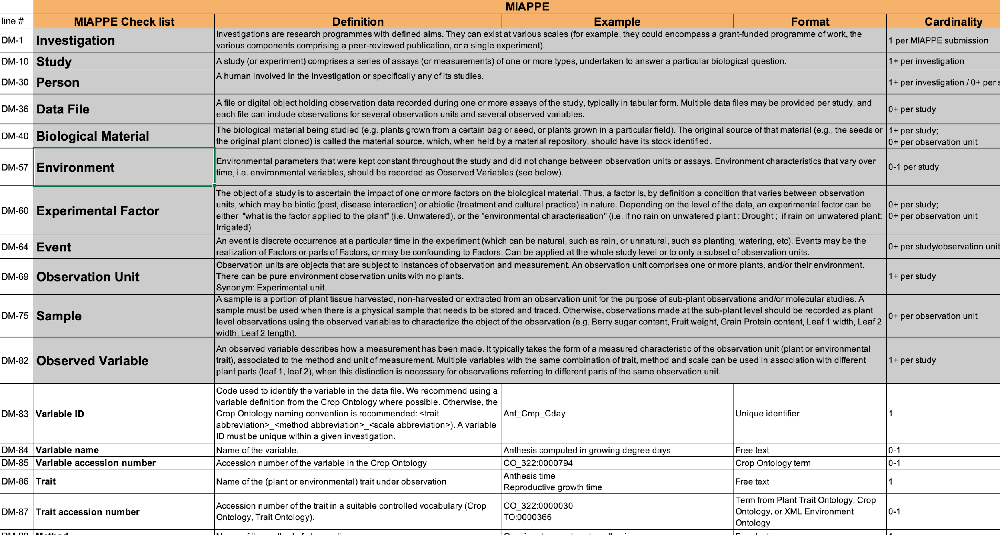
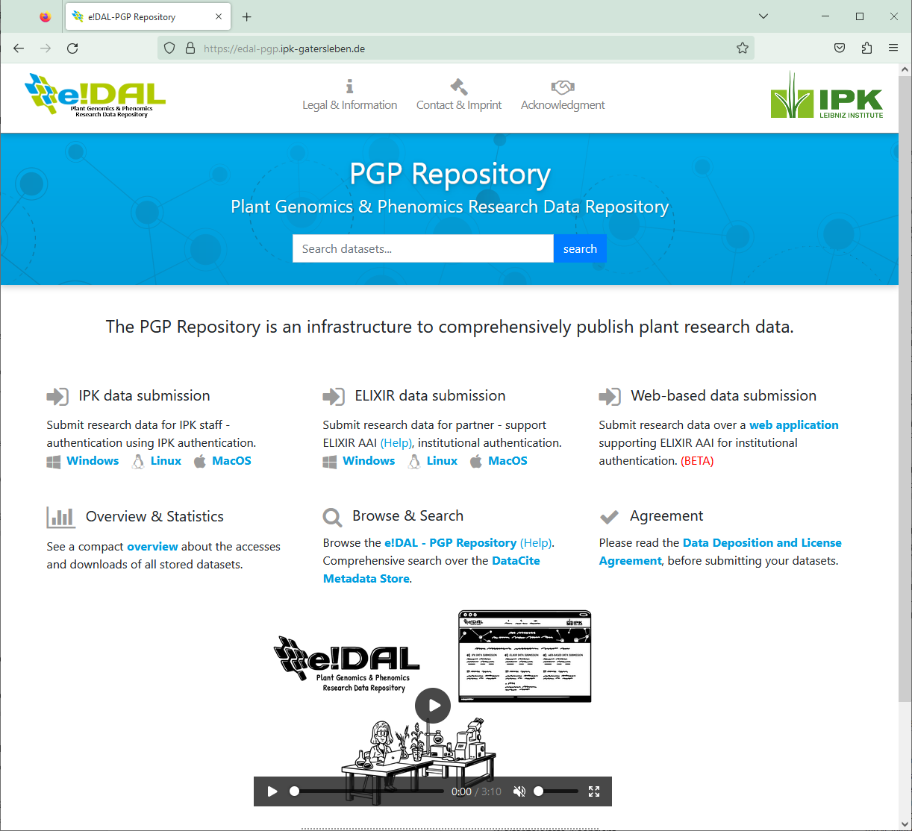
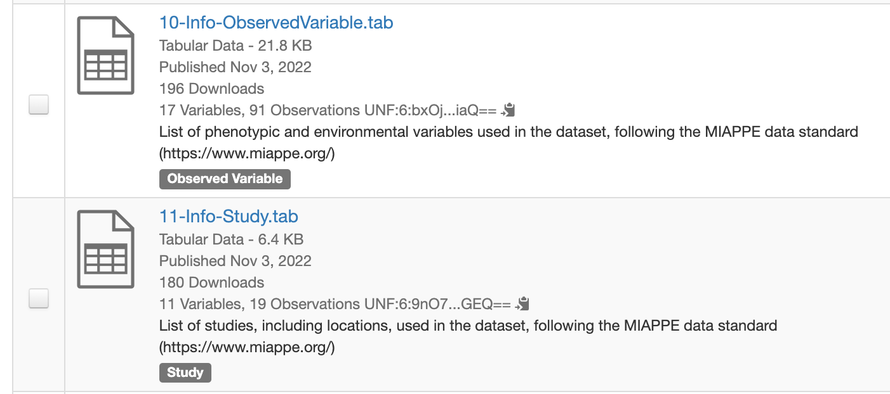
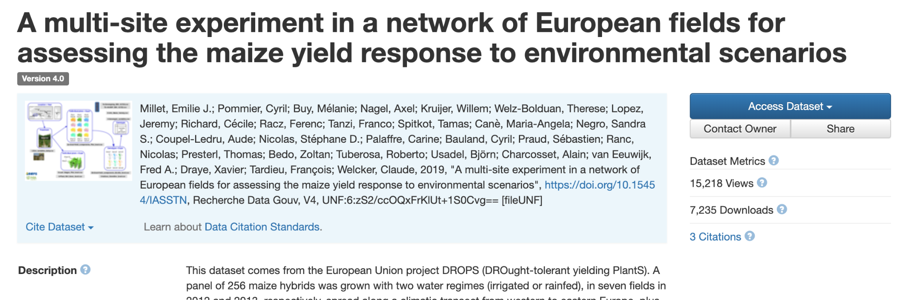

<!-- _class: lead -->
<!-- _paginate: false -->

# Overview of Metadata Standards in Plant Sciences and Federated Discovery

**Resources for Plant Sciences: Data Integration and Interpretation Tools**

Tutorial Series · Systems biology, Multi-omics Integration and Modelling
GitHub: `NIB-SI/ECCB2026_T12` · 2026

---

## Agenda

1. **Why metadata?**
2. **FAIR principles**
3. **Data standards**
4. **MIAPPE** 
5. **Data repositories**
6. **Publishing workflows** 
7. **Federated discovery**

---

## The Problem: Data Without Context

<table class="noborder" style="width:100%; table-layout:fixed;"><tr>
<td style="width:50%; vertical-align:top; padding-right:1em;">
Plant research generates enormous volumes of data — but most of it cannot be reused:
<ul>
<li>Measurements in lab notebooks or local spreadsheets</li>
<li>No description of biological material, location, or conditions</li>
<li>Variable names like <code>HT_1</code>, <code>yield_final</code> — meaningful only to the author</li>
<li>No persistent identifier — impossible to cite, link, or find</li>
</ul>
<blockquote>A dataset without metadata is just numbers</blockquote>
</td>
<td style="width:50%; vertical-align:top; text-align:center;">

</td>
</tr></table>

---

## The FAIR Principles

<table class="noborder" style="width:100%; table-layout:fixed;"><tr>
<td style="width:60%; vertical-align:top; padding-right:1em;">
<small>Wilkinson et al. (2016) <em>Scientific Data</em></small>

| | Principle | In practice |
|--|-----------|------------|
| **F** | Findable | Persistent identifier (DOI), rich metadata, indexed |
| **A** | Accessible | Open protocol, authentication where needed |
| **I** | Interoperable | Controlled vocabularies, standard formats |
| **R** | Reusable | Clear licence, provenance, community standards |

</td>
<td style="width:40%; vertical-align:middle; text-align:center;">

> FAIR ≠ open access — data can be FAIR and still access-controlled
</td>
</tr></table>

---

## What This Session Covers

<table class="noborder" style="width:100%; table-layout:fixed;"><tr>
<td style="width:55%; vertical-align:top; padding-right:1em;">
<strong>Why do metadata standards matter?</strong> 
The plant sciences generate diverse, distributed data — phenotyping, genotyping, multi-omics. Without standards, this data cannot be reused, integrated, or discovered.  
<strong>This session covers:</strong>
<ul>
<li>The FAIR principles and what they mean for plant data</li>
<li>MIAPPE — the plant phenotyping metadata standard</li>
<li>Tools for publishing FAIR plant data (Dataverse, e!DAL-PGP)</li>
<li>Federated discovery with FAIDARE</li>
</ul>
</td>
<td style="width:45%; vertical-align:top;">

</td>
</tr></table>

---

## Why Standardise Phenotyping Data?

<table class="noborder" style="width:100%; table-layout:fixed;"><tr>
<td style="width:60%; vertical-align:top; padding-right:1em;">
<strong>To enable reuse</strong> — by anyone, including yourself:
<ul>
<li>Metadata about the experiment: who, what purpose, where, how</li>
</ul>
<strong>To enable automatic integration:</strong>
<ul>
<li>Phenotype = measurement on a <em>cultivar</em> at GPS + time</li>
<li>Genotype = marker alleles on a <em>cultivar</em></li>
<li>Climate = climatic data at GPS + time</li>
</ul>
<strong>To enable knowledge discovery:</strong>
<ul>
<li>Metadata, controlled vocabularies, ontologies</li>
</ul>
</td>
<td style="width:40%; vertical-align:top; text-align:center;">
 
<small>Leaf area over time — same experiment, different genotypes</small>
</td>
</tr></table>

---

## Phenotype Data Lifecycle

<table class="noborder" style="width:100%; table-layout:fixed;"><tr>
<td style="width:55%; vertical-align:top; padding-right:1em;">
<strong>From data acquisition to knowledge</strong>
<ul>
<li><strong>Raw data</strong> — pheno/env measurements, variables</li>
<li><strong>Derived data</strong> — computed, reduced, indicators</li>
<li><strong>Knowledge</strong> — scientific publication and reuse</li>
</ul>
Each experimental dataset can generate <strong>many derived datasets</strong> for different scientific questions.  
FAIR data enables <strong>traceability, reproducibility & provenance</strong> across the lifecycle.
</td>
<td style="width:45%; vertical-align:top;">
<blockquote>
<strong>Genotyping:</strong> Computed data + Raw option  
<strong>Phenotyping:</strong> Raw measurements + Derived indicators  
<strong>Solutions needed at every stage:</strong> 
· Data standardisation 
· Repositories for publication 
· Findability / discovery
</blockquote>
</td>
</tr></table>

---

## Data Standards for FAIR

| Layer | Focus | Who drives it |
|-------|-------|--------------|
| **Semantic** | Controlled vocabularies, ontologies — describe the data | Biologist |
| **Structural** | Data models, formats — CSV, VCF, GFF, MIAPPE | Biologist + CS |
| **Technical** | Interoperability, tools — GA4GH, BrAPI | Computer scientist |

**Persistent Unique Identifiers** underpin all layers: URI, gene ID, accession ID, trait ID, DOI

---

## Metadata Standards in Plant Sciences

<small><small>

| Domain | Standard | What it describes |
|--------|----------|------------------|
| **Germplasm / biological material** | MCPD — Multi-Crop Passport Descriptors | Species, accession, provenance, genebank ID |
| **Phenotyping experiments** | MIAPPE v1.1 | Study design, variables, observation units |
| **Environmental / metagenomic samples** | MIxS / MIMARKS (GSC) | Soil, environment, sequencing context |
| **Trait definitions** | Crop Ontology (CO) | Controlled vocabulary: trait + method + scale |
| **Data exchange containers** | ISA-Tab · RO-Crate | Structured archive packaging investigation + studies |
| **Web services** | BrAPI — Breeding API | REST API for breeding and phenotyping data |
| **General dataset** | Dublin Core · DataCite | Title, author, DOI — minimal discovery metadata |

> Most plant datasets need **more than one** — MIAPPE + MCPD + Crop Ontology is a typical combination

</small></small>

---

## Data Repositories for Plant Data

<table class="noborder" style="width:100%; table-layout:fixed;"><tr>
<td style="width:50%; vertical-align:top; padding-right:1em;">
<strong>Thematic repositories</strong>
<ul>
<li><strong>Pros:</strong> Precise dataset description, good quality metadata</li>
<li><strong>Cons:</strong> Not available for all data types (e.g. phenotyping); time-consuming curation</li>
</ul>
Examples: GnpIS, e!DAL-PGP, PIPPA, PHIS
</td>
<td style="width:50%; vertical-align:top;">
<strong>Generalist repositories</strong>
<ul>
<li><strong>Pros:</strong> Any data type — flexible; rapid submission; author/title/DOI minimal metadata</li>
<li><strong>Cons:</strong> Weak biological description; non-standard formats; reduced FAIR compliance</li>
</ul>
Examples: Zenodo, Dataverse, Figshare  
<blockquote>Generalist repos need <strong>guidance + optional validators</strong> to reach acceptable FAIR levels for plant data</blockquote>
</td>
</tr></table>

---

## Why Generic Repositories Need Companion Metadata

Generic repositories provide only broad metadata — year, data type, author, organism (no controlled vocabulary), keywords — and lack plant phenomics-specific fields:

- **Biological material** — from species to genetic resource accession
- **Traits** — observation variables with method and unit
- **Experiment locations** — GPS, environment conditions
- **Experimental factors** — treatments applied

> Solution: dedicated metadata scheme as **companion files** — not filling long forms in the repository, but structured files alongside the data

This is exactly what **MIAPPE** provides.

---

<!-- _class: section-break -->

# MIAPPE

Minimum Information About Plant Phenotyping Experiments

---

## What is MIAPPE?

**MIAPPE v1.1** (Jan 2019) — the plant phenotyping metadata standard

- Crops and woody plants · open community: RFCs, GitHub, meetings & workgroups
- Stakeholders: ELIXIR, EMPHASIS, Bioversity, North American PPN

> Papoutsoglou et al. (2020) Enabling reusability and interoperability of plant phenomic datasets with MIAPPE 1.1. *New Phytologist*, 227:260–273.

---

## MIAPPE — Biologist Friendly

**Minimal and sufficient metadata:**
- Objective of the experiment
- Contributors
- Experimental procedures
- Biological material

**Resources:** clear definitions, examples, Excel templates, trainings

**Collaborating with other standards:**
- MCPD — biological material identification
- Crop Ontology — trait description
- Breeding API — web services
- ISA — data exchange container · RO-Crate

---

## MIAPPE Implementations

<table class="noborder" style="width:100%; table-layout:fixed;"><tr>
<td style="width:50%; vertical-align:top; padding-right:1em;">
<strong>Formats & APIs</strong>
<ul>
<li>Ontology / OWL: github.com/MIAPPE/MIAPPE-ontology</li>
<li>File archive: ISA-Tab, RO-Crate</li>
<li>Web services: Breeding API (BrAPI)</li>
</ul>
<strong>Databases (collecting)</strong>
<ul>
<li>PIPPA · PHIS</li>
</ul>
<strong>Databases (publishing)</strong>
<ul>
<li>GnpIS · data.inrae.fr · e!DAL-PGP · BioSamples</li>
</ul>
<strong>Data portals</strong>
<ul>
<li><a href="https://rdmkit.elixir-europe.org/plant_phenomics_assembly">rdmkit.elixir-europe.org</a> — Plant Phenomics assembly</li>
<li>www.miappe.org</li>
</ul>
</td>
<td style="width:50%; vertical-align:top; text-align:center;">
 
<small>MIAPPE data model — key entities and relationships</small>
</td>
</tr></table>

---

<!-- _class: section-break -->

# MIAPPE Structure

The ISA backbone and data model

---

## MIAPPE v1.1 — The ISA Backbone

| Level | Scope |
|-------|-------|
| **Investigation** | Whole dataset |
| **Study** | One experiment in one location, one or several years |
| **Assay (Observed variable)** | Trait or index (phenotypic or environmental) |
| **Observation Unit** | Plant · Microplot · Block · Trial… |
| **Data file** | Any format — tabular, images, NIR spectra… |

> Observed variable = **Level + Trait + Method + Scale/Unit**

---

## MIAPPE v1.1 — Observed Variable (Assay)

**Phenotyping/environment variable = Trait + Method + Unit/Scale**

Example — Plant Height:
- **T1:** Plant Height
- **M1:** Total height · **M2:** First tassel branch · **M3:** Last expanded leaf · **M4:** Youngest growing leaf · **M5:** Highest pixel
- **U1:** cm · **U2:** mm · **U3:** pixel

**Scope:** plant-specific traits + general *-omics* (Gene Ontology)

---

## MIAPPE v1.1 — Biological Material

**Material Source** — accession, cultivar/variety, region of provenance, laboratory cross
- MCPD: Genebank/Lab + Species + accession number · DOI

**Biological Material** — seed lot, cuttings, material used in the study
- Lab + internal accession number (mandatory) · URI · BioSample ID

**Samples** — detached leaves, other plant parts
- Lab + internal accession number · BioSample ID

---

## MIAPPE v1.1 — Other Important Sections

| Section | Content |
|---------|---------|
| **Investigation** | Title, description, contacts, licence |
| **Study** | Location, dates, experimental design |
| **Assay** | Observed variable definitions |
| **Observation Unit** | Hierarchy of experimental units |
| **Sample** | Physical samples taken |
| **Experimental Factor** | Treatments applied |
| **Events** | Irrigation, fertilisation, etc. |
| **Environment** | Climate, soil conditions |
| **Files** | Data files and their metadata |

---

## MIAPPE Specifications

<table class="noborder" style="width:100%; table-layout:fixed;"><tr>
<td style="width:40%; vertical-align:top; padding-right:1em;">
<strong>Online resources</strong>
<ul>
<li>Specification + checklist: <a href="https://www.miappe.org">www.miappe.org</a></li>
<li>GitHub: <code>github.com/MIAPPE/MIAPPE</code></li>
<li>Ontology: <code>github.com/MIAPPE/MIAPPE-ontology</code></li>
</ul>
Sections × metadata fields table with definitions, examples, cardinality, and links to controlled vocabularies
</td>
<td style="width:60%; vertical-align:top;">

</td>
</tr></table>

---

<!-- _class: section-break -->

# Publishing Plant Phenotyping Data

Tools, repositories, and workflows

---

## Plant Phenomics Tool Assembly

<table class="noborder" style="width:100%; table-layout:fixed;"><tr>
<td style="width:50%; vertical-align:top; padding-right:1em;">
<strong>Data management planning</strong>
<ul><li>Data Stewardship Wizard</li></ul>
<strong>Experimental data gathering</strong>
<ul>
<li>MIAPPE Template</li>
<li>File-based: FAIRDOM-SEEK, pISA-tree, COPO</li>
<li>High-throughput: PHIS, PIPPA</li>
</ul>
<strong>Entry point & guidelines</strong>
<ul><li><a href="https://rdmkit.elixir-europe.org/plant_phenomics_assembly">rdmkit.elixir-europe.org/plant_phenomics_assembly</a></li></ul>
</td>
<td style="width:50%; vertical-align:top;">
<strong>Data sharing & repositories</strong>
<ul>
<li><strong>Dataverses</strong> — generalist, MIAPPE companion files</li>
<li><strong>e!DAL-PGP</strong> — plant genomics & phenomics, large data</li>
<li><strong>Zenodo</strong> — generalist, FAIR</li>
<li><strong>GnpIS</strong> — plant genetics & phenomics (INRAE)</li>
</ul>
<strong>Metadata management</strong>
<ul>
<li>MIAPPE ontology / ISA-Tab / BrAPI</li>
<li>Frictionless validator (FAIRDOM)</li>
</ul>
</td>
</tr></table>

---

## FAIDARE — Federated Discovery Across Plant Databases

<table class="noborder" style="width:100%; table-layout:fixed;"><tr>
<td style="width:55%; vertical-align:top; padding-right:1em;">
<strong>FAIR Data-finder for Agronomic REsearch</strong> 
<a href="https://urgi.versailles.inra.fr/faidare/">urgi.versailles.inra.fr/faidare/</a>  
A <strong>federated search engine</strong> indexing multiple plant science resources simultaneously — one query, many databases:  
<ul>
<li>Ensembl Plants · GnpIS · Gramene Plants</li>
<li>SKM · KnetMiner · OPTIMAS-DW · brapi@EVA</li>
<li>Filter by taxon group, data type, collection, database</li>
<li>Ontology annotation search & expand</li>
</ul>
Data providers include: Gramene · EBI · INRAE-URGI · NIB · Rothamsted Research · EVA · IPK
</td>
<td style="width:45%; vertical-align:top;">
<blockquote>
<strong>Why FAIDARE matters:</strong> 
Published data in MIAPPE-compliant repositories becomes <strong>findable</strong> through FAIDARE — closing the FAIR loop.  
FAIR: Findable · Accessible 
Interoperable · Reusable  
FAIDARE = the <strong>F</strong> in FAIR for plant data
</blockquote>
</td>
</tr></table>

---

## FAIDARE — Federated Discovery Across Plant Databases

<!-- ---

## e!DAL-PGP — Plant Genomics & Phenomics Repository

<table class="noborder" style="width:100%; table-layout:fixed;"><tr>
<td style="width:60%; vertical-align:top; padding-right:1em;">
<strong>e!DAL</strong> (electronic Data Archive Library) — generic infrastructure for archiving & publishing research data in a FAIR way
<ul>
<li>No data type or volume limitation</li>
<li>FAIR compliant — DOIs, DublinCore, BioSchemas</li>
<li>Integrated peer-review-like approval process</li>
<li>Embedded metadata (schema.org) allows harvesting</li>
<li>Desktop app & web client for submission</li>
</ul>
<strong>e!DAL-PGP</strong> — the plant-specific instance 
<a href="https://www.edal-pgp.ipk-gatersleben.de">www.edal-pgp.ipk-gatersleben.de</a>  
Arend et al. 2016, <em>Database</em> doi:10.1093/database/baw033
</td>
<td style="width:40%; vertical-align:top;">

</td>
</tr></table> -->

---

## Publishing with MIAPPE in Dataverse

<table class="noborder" style="width:100%; table-layout:fixed;"><tr>
<td style="width:55%; vertical-align:top; padding-right:1em;">
<strong>Step-by-step process:</strong>
<ol>
<li>Create dataset in sub-dataverse</li>
<li>Add mandatory plant phenotyping metadata (MIAPPE fields)</li>
<li>Add generic metadata (title, authors, description)</li>
<li>Upload data files + MIAPPE companion file</li>
<li>Publish — get DOI</li>
</ol>
<strong>Good practice:</strong> include human-friendly provenance — links between files, README, variable definitions  
Example: DROPS project dataset 
<a href="https://doi.org/10.15454/IASSTN">doi.org/10.15454/IASSTN</a>
</td>
<td style="width:45%; vertical-align:top;">
 
<small>MIAPPE companion files in a published Dataverse dataset</small>
</td>
</tr></table>

---

## Dataverse — Published Dataset Example

<small>DROPS project — multi-site maize experiment · <a href="https://doi.org/10.15454/IASSTN">doi.org/10.15454/IASSTN</a> · <a href="https://faircookbook.elixir-europe.org/content/recipes/reusability/plant-pheno-data-publication.html">FAIR Cookbook FCB083</a></small>

---

## MIAPPE Template & Validation Tools

<table class="noborder" style="width:100%; table-layout:fixed;"><tr>
<td style="width:55%; vertical-align:top; padding-right:1em;">
<strong>MIAPPE Template</strong>
<ul>
<li>Excel/spreadsheet template for metadata collection</li>
<li>MIAPPE v1.2 templates: <a href="https://github.com/MIAPPE/MIAPPE/tree/v1.2/Templates">github.com/MIAPPE/MIAPPE</a></li>
</ul>
<strong>Frictionless Validator</strong>
<ul>
<li>Based on <a href="https://framework.frictionlessdata.io/">Frictionless framework</a></li>
<li>Checks MIAPPE files for validity, tags Valid/Invalid</li>
<li>Generates detailed validation reports</li>
<li>Deployed as container, checks every 5 min</li>
</ul>
<strong>FAIRDOM-SEEK</strong>
<ul>
<li>For confidential project data management</li>
<li>ISA-based, MIAPPE compliant</li>
<li><a href="https://seek4science.org/">seek4science.org</a></li>
</ul>
</td>
<td style="width:45%; vertical-align:top;">
<blockquote>
<strong>Validator workflow:</strong> 
1. Upload file to FAIRDOM 
2. Wait 5–15 min for report 
3. Review errors in report 
4. Correct file in spreadsheet 
5. Upload corrected version 
6. Repeat until Valid ✓
</blockquote>
</td>
</tr></table>

---

## Take-Home Messages

<table class="noborder" style="width:100%; table-layout:fixed;"><tr>
<td style="width:50%; vertical-align:top; padding-right:1em;">
<strong>...</strong>
<ul>
<li></li>
<li></li>
<li></li>
<li></li>
</ul>
<strong>Specialist repositories</strong>
<ul>
<li></li>
<li></li>
</ul>
</td>
<td style="width:50%; vertical-align:top;">
<strong>Entry points & guidelines</strong>
<ul>
<li><a href="https://rdmkit.elixir-europe.org/plant_phenomics_assembly">RDMKit Plant Phenomics assembly</a></li>
<li></li>
<li></li>
</ul>
<strong>Tools</strong>
<ul>
<li></li>
<li></li>
<li></li>
<li></li>
</ul>
</td>
</tr></table>

---

## Acknowledgements

**ELIXIR Plant Community & platforms**

...

