<!-- _class: lead -->
<!-- _paginate: false -->

# Approaches for Orthology, Annotation, and Cross-Species Comparisons

**Resources for Plant Sciences: Data Integration and Interpretation Tools**

Tutorial Series · Systems biology, Multi-omics Integration and Modelling 
GitHub: `NIB-SI/ECCB2026_T12` · 2026

---

## Agenda

1. **Introduction**
2. **Plant genomes**
3. **Why orthology?**
4. **Data sources**
5. **Tools**
6. **Integration & annotation**
7. **Workflow & summary**

<!-- > Scripts: `scripts/00_protocol.Rmd` · Repository: `skm-translate` -->

---

<!-- _class: section-break -->

# Introduction

Orthology and sequence similarity

---

## What is Orthology?

**Homology** = evolutionary relatedness between sequences.

<!-- | Type | Definition | Evolutionary event |
|------|-----------|-------------------|
| **Orthologs** | Same gene in different species | Speciation |
| **Paralogs** | Duplicated genes within a genome | Gene/genome duplication |
| **Homeologs** | Orthologs from polyploidisation | Allopolyploidy |
| **Xenologs** | Horizontally transferred genes | HGT | -->

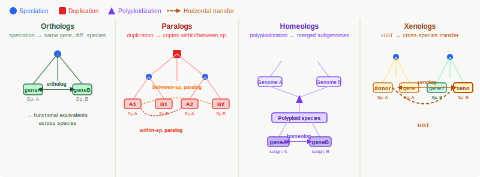

<small>

> **Key principle:** Orthologs tend to retain function across species — this is the basis for knowledge transfer from well-studied model organisms to less-studied crops
</small>


---

## Why Do We Need Multiple Methods?
No single tool is best in all situations. Each captures a different signal:

<small>

| Type | Objective | Species/genome version addition? | Stable? | E.g. approach |
|-------------|-----------|------------------------------------|-----------------------------|---------|
| Pairwise sequence similarity | Mutual best hits between two species | Each pair runs independently | Partially — ties broken arbitrarily | RBH BLAST+ |
| Graph clustering (all-vs-all) | Cluster all genes into orthogroups  | Requires full rerun | No — whole graph and clusters rebuilt | OrthoFinder |
| Pre-computed database | Query against fixed reference orthogroups | Database is frozen at release | N/A  | OrthoDB |

</small>

---

## Why Do We Need Multiple Methods?

<small>

| Type | Objective | Species/genome version addition? | Stable? | E.g. approach |
|-------------|-----------|------------------------------------|-----------------------------|---------|
| Gene tree reconciliation | Reconciling gene tree with species tree | Requires full rerun | Tree topology changes with new taxa | Compara, PLAZA, FastOMA |
| Synteny | Identify collinear gene blocks | Yes | Pairwise: Yes. Multi-way: No — changes block detection | JCVI/MCScanX |
| Functional classification | Assign functional bins to protein sequences | Yes | Depends on the reference dataset version | MapMan4/Mercator |

</small>

> **Strategy:** run all methods independently, then **integrate and filter** by priority and consensus — giving the most reliable set of ortholog pairs


<!-- > `Synteny → Phylo-trees from MSAs → pairwise sequence similarity` -->

---

<!-- _class: section-break -->

# Plant genomes

Complexity & Polyploidy

---

## Plant Genomes

Plants have some of the most **complex and dynamic genomes** of any organism:

- **Massive size range:** 135 Mbp (*Arabidopsis*) → 16 Gbp (wheat)
- **High repeat content:** up to 80–90% transposable elements in large genomes
- **Frequent polyploidy:** whole-genome duplications (WGD) throughout plant evolution
- **Ongoing gene family expansion:** NBS-LRR resistance genes, cytochrome P450s, ERFs and other TFs
- **Structural variation:** extensive inversions and translocations between closely related species

---

## Plant Genomes


<strong>Consequences for bioinformatics:</strong>
<ul>
<li>Many-to-many ortholog relationships</li>
<li>High risk of confusing paralogs with orthologs</li>
<li>Synteny breaks down across large evolutionary distances</li>
</ul>

<strong>Why it matters:</strong>
<ul>
<li>Most of study species are polyploids</li>
<li><em>Arabidopsis</em> is misleadingly "simple"</li>
</ul>


---

## Polyploidy

**Autopolyploidy** — duplication of the same genome
```
  A A  →  A A A A   (same species, chromosome doubling)
```

**Allopolyploidy** — hybridisation of two species + chromosome doubling
```
  A A + B B  →  A A B B   (hybrid, then doubling)
```

**Ancient / Paleopolyploidy** — old WGD followed by diploidisation
```
- ~70% of flowering plant species have a polyploid history
- Core eudicots share an ancient γ WGD
- Arabidopsis has undergone at least 3 WGDs
- Efficient diploidisation restored a diploid-like genome
```

---

## Consequences for Orthology

**Gene fates after WGD:**
- **Subfunctionalisation** — each copy retains part of the ancestral function
- **Neofunctionalisation** — one copy evolves a new function
- **Gene loss (fractionation)** — one copy silenced and eventually deleted
- **Dosage balance** — transcription factors and kinases often retained in pairs

---

## Ploidy Diversity Across Plant Genomes

<small>

| Species | Ploidy | 2n | Key point |
|---------|--------|----|-----------|
| *Arabidopsis thaliana* | Diploid | 10 | Ancient WGDs; model of diploidisation |
| *Vitis vinifera* | Diploid | 38 | Slowly evolving genome; preserves ancestral genome structure |
| *Malus domestica* | Diploid | 34 | Lineage-specific WGD; extensive retained duplicates |
| *Solanum lycopersicum* | Diploid | 24 | Solanaceae WGD; representative crop genome |
| *Solanum tuberosum* | Segmental allotetraploid | 48 | Substantial heterozygosity and historical introgression |
| *Triticum aestivum* | Allohexaploid | 42 | Three subgenomes (AABBDD); major cereal crop |
| *Fragaria × ananassa* | Octoploid | 56 | Four subgenomes (4 diploid progenitors); complex allopolyploid origin |

</small>


---

<!-- _class: section-break -->

# Why bother?

Context and motivation

---

## *Exploiting the untapped potential of fruit tree wild diversity for sustainable agriculture*

<small>**FruitDiv** · Horizon Europe · fruitdiv.eu

**The problem:** Current fruit production relies on a handful of **elite cultivars** — high yield and shelf life, but declining resistance to pests and disease and vulnerable to climate change

**Crop Wild Relatives (CWR)** of pome (*Malus*, *Pyrus*) and stone (*Prunus*) fruits hold untapped genetic diversity:
<small>
- Pest and disease resistance
- Drought and salinity tolerance
- Adaptability to marginal lands and fluctuating climates
</small>

> **Cross-species orthology** — to unlock stress tolerance traits from wild relatives and transfer functional knowledge into breeding programmes, we must first know which genes are equivalent across species

</small>

---

## *Accelerated Development of multiple-stress tolerant Potato*

<small>**ADAPT** · Horizon Europe · adapt.univie.ac.at 

**The problem:** Potato is a non-model polyploid staple crop and a extremely sensitive to environmental stress:
- Heat + drought → yield reduction, quality losses
- Flooding → entire harvest lost within 1–2 days

> Cross-species orthology links **conserved signalling pathways** from model species to potato

</small>

---

## The Knowledge Gap: Model to Crop

**The challenge:** Most molecular knowledge comes from model organisms — not from crops

```
  Arabidopsis thaliana          Cultivars
  ────────────────────          ──────────────────────
  Fully annotated               Partially annotated
  40+ years of research         Limited functional data
  Thousands of mutants          Few or no mutants
  Rich ontology annotations     Many genes = "unknown"
  Deep stress response data     Stress mechanisms not fully understood
  High-quality genome           T2T genomes are more an exception than a rule
```

---

## The Knowledge Gap: Model to Crop

**Orthology-based annotation transfer bridges this gap:**

1. Identify ortholog of Arabidopsis stress gene in potato / apple / peach
2. Transfer ontology terms, pathway membership, knowledge graph node assignment
3. Prioritise candidates for experimental validation
4. Feed into multi-omics research and pre-breeding programmes

> Without reliable orthologs, functional genomics in crops starts from zero every time

---

<!-- _class: section-break -->

# Data Sources

The genomes, databases, and reference resources


---

## Databases & Data Sources

<small><small>

<table>
<tr><th style="background:var(--canopy); color:var(--paper);">Type</th><th style="background:var(--canopy); color:var(--paper);">Database</th><th style="background:var(--canopy); color:var(--paper);">Focus</th></tr>
<tr><td rowspan="5"><strong>Genome sources</strong></td><td><strong>GDR</strong></td><td>Rosaceae genomes and versions</td></tr>
<tr><td><strong>SpudDB / UniTato</strong></td><td>Potato genomes and versions</td></tr>
<tr><td><strong>Sol Genomics</strong></td><td>Solanaceae genomes and versions</td></tr>
<tr><td><strong>Grapedia</strong></td><td>Grapevine genomes and versions</td></tr>
<tr><td><strong>Phytozome</strong></td><td>Multi-species plant genomes</td></tr>
<tr><td rowspan="3"><strong>Orthology DBs</strong></td><td><strong>Ensembl Plants</strong></td><td>Pre-computed homologies</td></tr>
<tr><td><strong>PLAZA</strong></td><td>Plant orthogroups</td></tr>
<tr><td><strong>OrthoDB</strong></td><td>Hierarchical orthogroups (HOGs)</td></tr>
</table>

> **Note**: Genome versions and ID formats differ across databases for the same species
Primary/representative transcripts (longest isoform) are commonly used throughout bioinfo pipelines

</small></small>

---

<!-- _class: section-break -->

# Orthology Tools

Complementary methods

---

## OrthoFinder


<small>Emms & Kelly (2019) <em>Genome Biology</em></small>

<strong>Two modes:</strong> within-species (paralogs, **_genome versions_** and **_cultivars_**); between-taxa (orthologs)

Standard workflow
- DIAMOND or MMseqs2 (recommended, although BLAST+ can be used instead)
- MCL graph clustering algorithm
- FastME

MSA workflow
- Multiple sequence alignment program: MAFFT (recommended), Muscle
- Tree inference program: FastTree (recommended), IQTREE (takes a very large amount of time to run on a reasonable sized dataset), raxml

---

## OrthoFinder

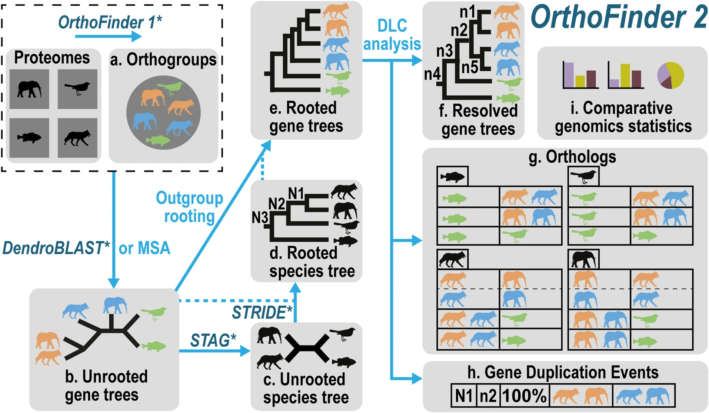

---

## OrthoFinder

<strong>Approach:</strong> DIAMOND ultra-sensitive + MCL clustering + IQ-TREE gene trees

<pre><code>
orthofinder -f "$input_dir" \
            -M msa \
            -S diamond_ultra_sens \
            -T iqtree \
            -t "$THREADS" \
            -n orthofinder \
            -o "$output_dir" 2>&1 | tee -a "$LOGFILE"
</code></pre>


<strong>Sanity check:</strong> parameter tuning based on diferent <em>ath</em> genome versions


---

## RBH (Reciprocal Best Hits)

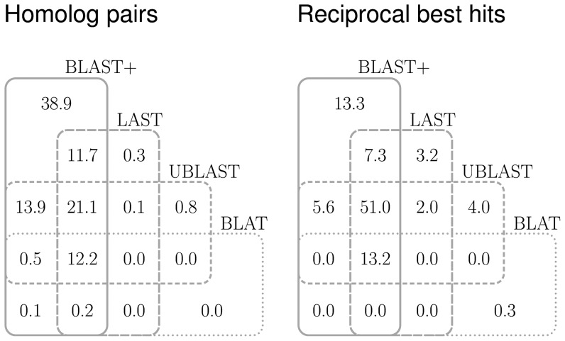
<small><small>https://doi.org/10.1371/journal.pone.0101850

> Note: Reciprocal best hits are not a logically sufficient condition for orthology (arXiv:0706.0117)
</small></small>

---

## RBH (Reciprocal Best Hits)

<small>

<strong>Approach:</strong> Bidirectional BLAST → keep only pairs that are each other's top hit: reciprologs

1. Download BLAST from https://ftp.ncbi.nlm.nih.gov/blast/ and install locally (R) and add path to blast /bin or add Bio.Blast.Applications module (Py)
2. e.g. in R: install dependencies
<pre><code>BiocManager::install(c("Biostrings", "GenomicFeatures", "GenomicRanges", 
"Rsamtools", "IRanges", "rtracklayer", "biomaRt"))
</code></pre>
3. e.g. in R: install <code>metablastr</code> and <code>orthologr</code> packages
<pre><code>devtools::install_github("HajkD/metablastr")
devtools::install_github("HajkD/orthologr")
</code></pre>
4. e.g. in R: run in R Console to see if it is working<br>
<pre><code>system("blastp -help")</code></pre>

</small>


---

## Ensembl Compara

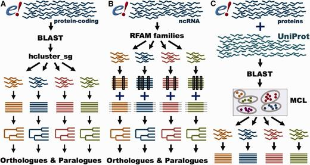


---

## Ensembl Compara

<small>Herrero et al. (2016) <em>Genome Biology</em> · Dyer et al. (2025) <em>Nucleic Acids Research</em>

> ftp.ebi.ac.uk/ensemblgenomes/pub/plants/release-X/tsv/ensembl-compara/homologies/
> Download both X→Y and Y→X tables to obtain all gene pairs

<strong>Approach:</strong> HMM (TreeFam) family classification → BLAST + hcluster_sg (orphans) → MSA (M-Coffee untill 2025 / MAFFT for large) → TreeBeST [5 trees: ML protein, ML codon, NJ p/dN/dS → consensus] → reconciliation vs Ensembl species tree/NCBI taxonomy-based species tree [mapping the gene tree onto the species tree]


<strong>High-confidence filters:</strong>
- GOC ≥ 50 [at least 2/4 flanking genes conserved]
- WGA ≥ 50 [LastZ/BlastZ genomic region alignment]
- % identity ≥ 25 [identical AA in pairwise alignment]

</small>


---

## PLAZA

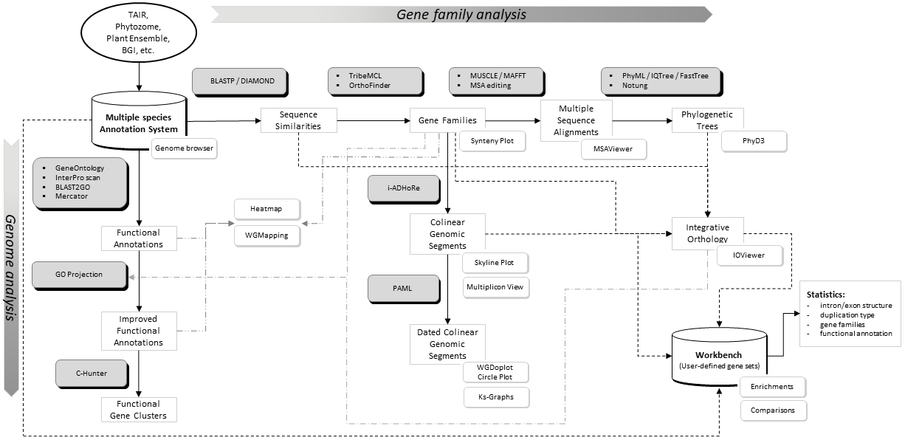


---

## PLAZA

<small><small>Van Bel et al. (2022) <em>Nucleic Acids Research</em>

**Approach:** DIAMOND + Tribe-MCL (families) → OrthoFinder (sub-families) → MAFFT → FastTree
[Notung 2.6 — roots trees, infers speciation/duplication nodes via Duplication/Loss Score]

Speciation nodes → orthologs · Duplication nodes → paralogs

<table style="width:100%; font-size:0.85em;">
<tr><th>Code</th><th>Type</th><th>Basis</th></tr>
<tr><td><strong>TROG</strong></td><td>Tree-based ortholog</td><td>Position in reconciled gene tree — most rigorous</td></tr>
<tr><td><strong>ORTHO</strong></td><td>Sequence cluster</td><td>MCL clustering — includes orthologs <em>and</em> paralogs</td></tr>
<tr><td><strong>BHIF</strong></td><td>Best hit + inparalogs</td><td>RBH-like — groups gene with best hit + recent duplicates</td></tr>
<tr><td><strong>ANCHOR</strong></td><td>Syntenic anchor</td><td>Collinear block from <code>i-ADHoRe</code> — supports WGD detection</td></tr>
</table>


>**Genome evolution:** `i-ADHoRe` — collinear blocks = multiplicons →`PAML` + `CLUSTALW` — aligns collinear CDS, calculates Ks (synonymous substitution rate) → peaks in Ks distribution date WGD events

</small>
</small>


<!-- ---

## OrthoDB / OrthoLoger

<small>
Kuznetsov et al. (2023) · Tegenfeldt et al. (2025) <em>Nucleic Acids Research</em>

<strong>Approach:</strong> MMseqs2 → best-reciprocal-hits → BRHCLUS clustering, hierarchical HOGs

<strong>Pipeline:</strong> OrthoFinder within-genome × OrthoDB pair table → merge on OrthoDB protein IDs → Cartesian join → gene-level pairs

</small> -->


---

## OrthoDB

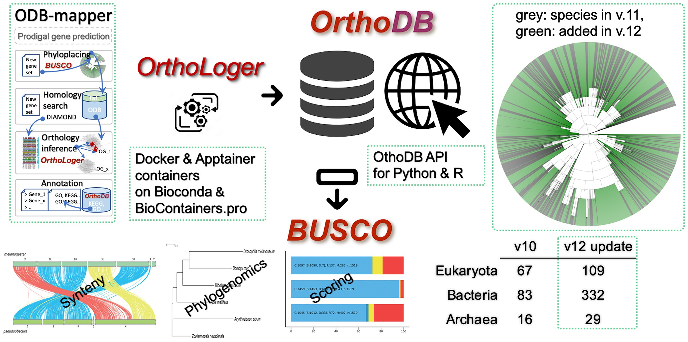

---

## OrthoDB / OrthoLoger

<small>
<small>
Kuznetsov et al. (2023) OrthoDB v11 · Tegenfeldt et al. (2025) OrthoDB v12 <em>Nucleic Acids Research</em>
</small>
<table class="noborder" style="width:100%; table-layout:fixed;"><tr>
<td style="width:50%; vertical-align:top; padding-right:1em;">
<strong>Design philosophy</strong>
<ul>
<li>Balances <em>sensitivity</em> and <em>specificity</em></li>
<li>OrthoFinder / OrthoMCL favour inclusivity → higher sensitivity but broader families (orthologs + paralogs mixed)</li>
<li>OrthoDB aims for accuracy of functional inference</li>
</ul>
<strong>OrthoLoger pipeline</strong>
<ul>
<li>Homology: <code>MMseqs2</code> or <code>DIAMOND</code></li>
<li>Low-complexity masking: <code>segmasker</code> (NCBI Blast)</li>
<li>Redundancy reduction: <code>cd-hit</code></li>
<li>Ortholog pairs: BRH between each species pair (proxy for gene tree reconciliation)</li>
<li>Clustering: <code>BRHCLUS</code></li>
</ul>
</td>
<td style="width:50%; vertical-align:top;">
<li><strong>v12:</strong> hierarchical mode guided by species tree → improves scalability and consistency across taxonomic levels</li>
<strong>OrthoLoger tools</strong>
<ul>
<li><code>ODB-mapper</code> — map FASTA file(s) to OrthoDB orthologs</li>
<li><code>orthologer</code> — find orthologs in a set of FASTA files (ab initio)</li>
</ul>
<strong>Protocol</strong>
<ul>
<li>Query level: <code>eudicotyledons</code></li>
<li><strong>OrthoFinder</strong> within-genome pairs × OrthoDB pair table</li>
<li>Merge on OrthoDB protein IDs → Cartesian join → gene-level pairs</li>
</ul>
</td>
</tr></table>
</small>


---

## FastOMA

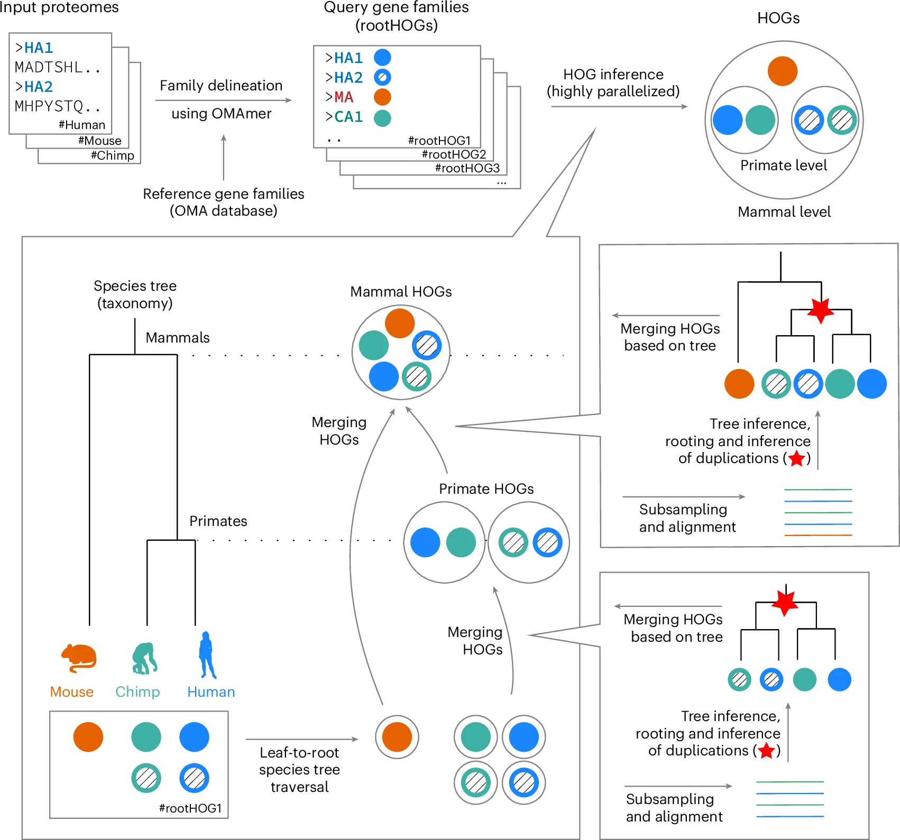


---

## FastOMA

<small>Majidian et al. (2025) <em>Nature Methods</em> · <a href="https://omabrowser.org/oma/academy/module/fastOMA">omabrowser.org/oma/academy/module/fastOMA</a>

**Key concept:** Hierarchical Orthologous Groups (HOGs) — nested gene families resolved at each taxonomic level; number of HOGs at a level = gene copies in that ancestral species

<table class="noborder" style="width:100%; table-layout:fixed;"><tr>
<td style="width:50%; vertical-align:top; padding-right:1em;">
<strong>Input</strong>
<ul>
<li>OMAmer DB: <code>Viridiplantae.h5</code> or custom</li>
<li>Rooted species tree (Newick, no branch lengths needed)</li>
<li>Protein FASTA files (<code>proteome/</code> folder)</li>
</ul>
<strong>Step 1 — Family inference</strong>
<ul>
<li><code>OMAmer</code> (alignment-free k-mer) → places proteins into reference HOGs</li>
<li><code>Linclust</code> → clusters unplaced proteins into novel families</li>
</ul>
</td>
<td style="width:50%; vertical-align:top;">
<strong>Step 2 — Orthology inference</strong>
<ul>
<li>Bottom-up traversal of species tree (leaf → root)</li>
<li><code>MAFFT</code> → <code>FastTree2</code> → speciation/duplication labeling</li>
<li>Species overlap ratio &lt; 0.1 → speciation → HOGs merged</li>
<li>Duplication → HOG split</li>
</ul>
<strong>Output</strong>
- Ortholog groups; process _ath_-plant pairs
</td>
</tr></table>


</small>


---

## FastOMA

Custom config: 
<pre><code>
params {
  write_msas = true
  report = true
  write_genetrees = true
  force_pairwise_ortholog_generation = true
  filter_method = 'col-elbow-row-threshold'
  filter_gap_ratio_row = 0.3
  filter_gap_ratio_col = 0.3
  nr_repr_per_hog = 12
  min_sequence_length = 40
}
</code></pre>

---

## FastOMA

Custom DB: 
<pre><code>
# in ./oma_path/
wget https://omabrowser.org/All/OmaServer.h5
wget https://omabrowser.org/All/speciestree.nwk

# NCBITaxonId | ParentTaxonId | Name
# 1437201 | 91827 | Pentapetalae

omamer mkdb --db Pentapetalae.h5 --oma_path ./oma_path/ \
--root_taxon "Pentapetalae" --nthreads 28 --log_level info
</code></pre>

---

## FastOMA


<pre><code>
nextflow run ../FastOMA.nf -profile standard \
  --input_folder ./input \
  --output_folder output \
  --omamer_db ./input/Viridiplantae.h5 \
  --max_cpus 64 \
  --fasta_header_id_transformer noop \
  --with-report \
  -c ./input/my_custom.config | tee run4.log
  
  
nextflow run ../FastOMA/FastOMA.nf -profile standard \
  --input_folder ./input \
  --output_folder output \
  --omamer_db ./input/Pentapetalae.h5 \
  --max_cpus 24 \
  --fasta_header_id_transformer noop \
  --with-report \
  -c ./input/my_custom.config | tee run4_Pentapetalae.log
</code></pre>


---

## FastOMA

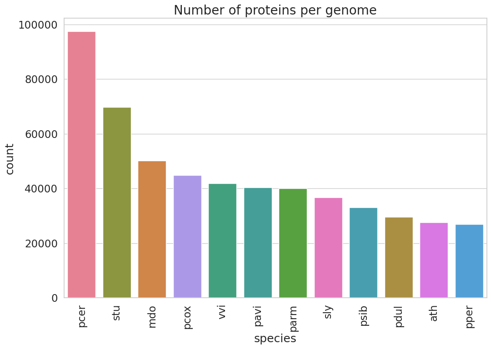

---

## FastOMA

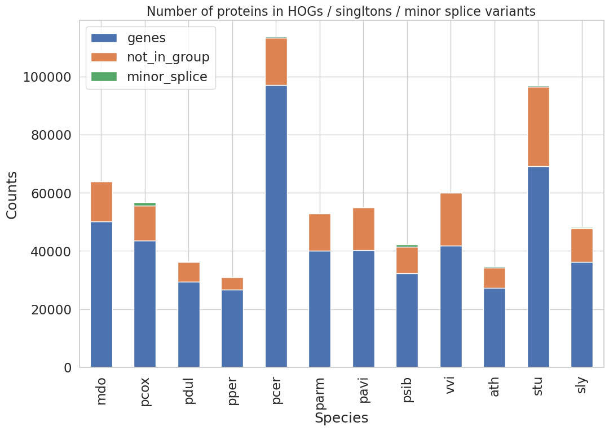


---

## Synteny Analysis

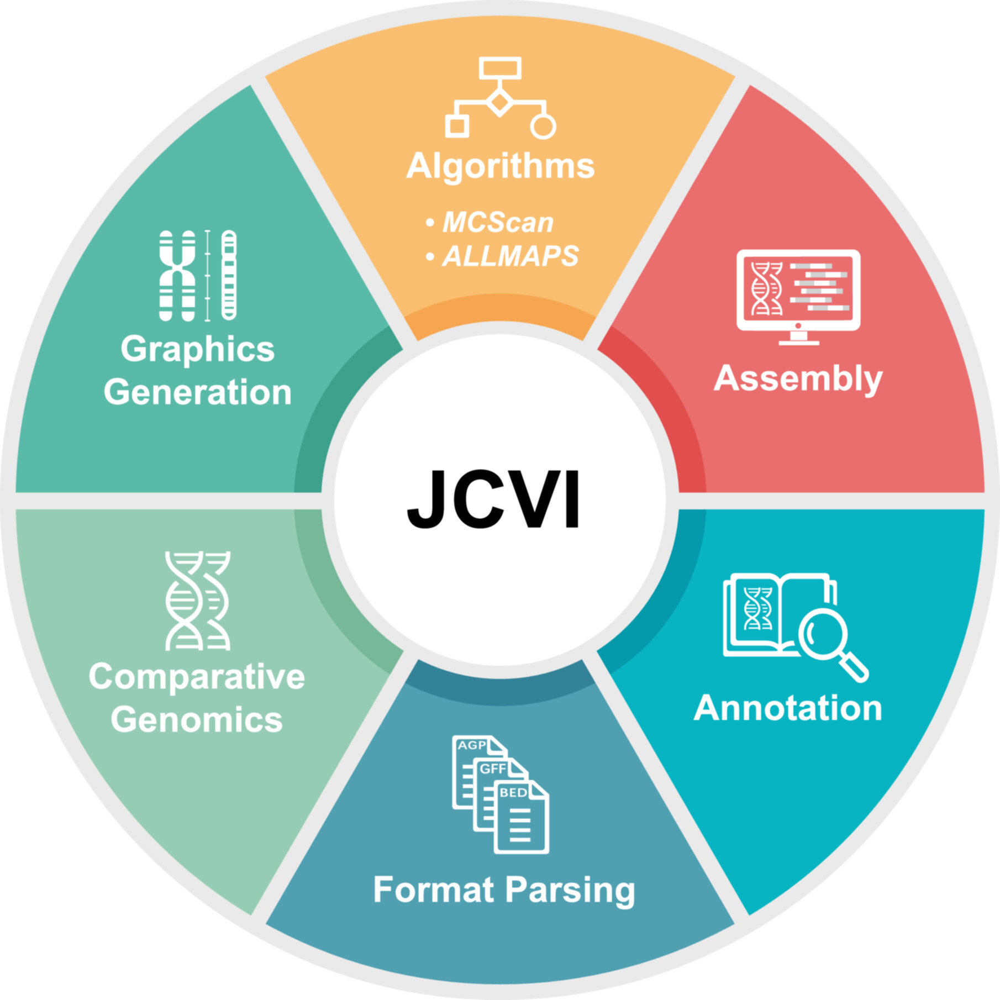

---

## Synteny Analysis — JCVI / MCScanX

<small>Tang et al. (2024) <em>iMeta</em>

<strong>Pipeline</strong>
<ol>
<li><code>LAST</code> — find & align related regions → <code>.last</code></li>
<li>Filter: remove tandem duplicates & weak hits → <code>.last.filtered</code></li>
<li>Cluster anchors into synteny blocks:<br>
<code>.anchors</code> — seed blocks (high quality)<br>
<code>.lifted.anchors</code> — final extended blocks</li>
</ol>
<strong>Notes</strong>
<ul>
<li>C-score filtering avoids hard E-value cutoffs and repeat artefacts</li>
<li>Use <code>--key=Name</code> or <code>--key=ID</code> depending on GFF; <code>--primary_only</code> takes first listed isoform — check your GFF</li>
</ul>

</small>


---

## Synteny Analysis — JCVI / MCScanX

<small>

<pre><code># create .bed
## keeping one isoform per gene (parameter --primary_only) is problematic, 
## since it takes first listed
python -m jcvi.formats.gff bed --type=mRNA --key=Name X.gff3.gz -o X.bed;
# or
python -m jcvi.formats.gff bed --type=mRNA --key=ID X.gff3 -o X.bed;

# create .CDS fasta
python -m jcvi.formats.fasta format X.cds.fa.gz X.cds

# run pairwise synteny search
python -m jcvi.compara.catalog ortholog plant1 plant2 --no_strip_names

# run pairwise synteny visualization
python -m jcvi.graphics.dotplot plant1.plant2.anchors
python -m jcvi.compara.synteny depth --histogram plant1.plant2.anchors

# macrosynteny visualization
python -m jcvi.compara.synteny screen --minspan=30 \
--simple plant1.plant2.anchors plant1.plant2.anchors.new
python -m jcvi.graphics.karyotype seqids layout
</code></pre>

</small>

---

## Synteny Analysis

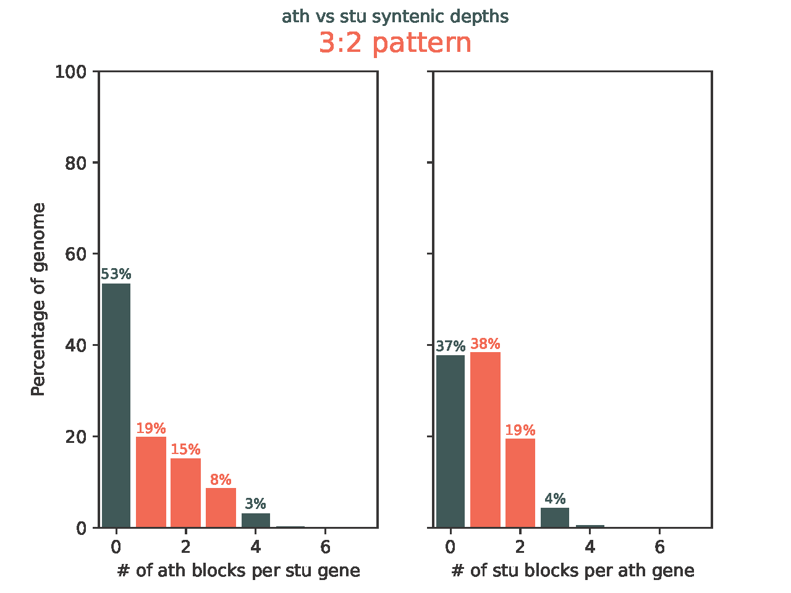


---

## Synteny Analysis

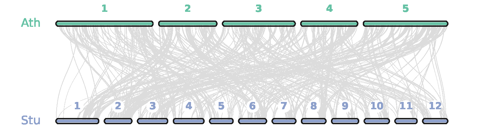


---

<!-- _class: section-break -->

# Integration & Annotation

Combining multiple methods into a final ortholog set

---

## Integration Strategy — Filter Logic

Results from all six tools combined with a **priority-based filter**:

```
Priority order:
  1. MCScanX        ← synteny (highest confidence)
  2. Ensembl Compara
  3. PLAZA
  4. OrthoDB  ┐
  5. RBH      ├── require ≥ 2/3 agreement
  6. FastOMA  ┘    OR MapMan4 corroboration

Rule: once a from_geneID is assigned, it cannot be reassigned
      (covered_genes set — prevents double-counting)
```


---

## Annotation — MapMan4 / Mercator7

**Mercator v4.x** (web tool) — assigns **MapMan4 BINs**: hierarchical functional classification for plants

**Input:** per-species protein FASTA → `Y_Mercator4vX_results.txt`
**Output columns:** `IDENTIFIER` · `BINCODE` · `NAME` · `DESCRIPTION`

- Normalise IDs + collapse multiple BINs per gene

> Note: Each species required custom ID regex normalisation (case fixes, isoform stripping, special translation tables fo <em>stu</em>)

> MapMan4 brings **independent biological context** — a single method's ortholog call becomes credible when both genes share the same functional BIN


---

## Ortholog Validation — Additional Evidence

Independent biological data serve as checkpoints for ortholog calls:

- **qPCR primer sets** — existing primers and expression data confirm orthology
- **Validated genome-scale metabolic models** — functional GEMs confirm genes are assigned to correct enzymatic reactions
- **TF functional cluster databases** — curated databases group transcription factors into functional clusters, providing an independent reference
- **Ontology terms and functional annotations** — shared GO terms, pathway membership, curated  functional annotations across species corroborate ortholog assignments

---

## From Ortholog Table to Biological Insight


The final ortholog table feeds directly into downstream biology:

- Orthologs from Arabidopsis carry established pathway membership
- Each gene in potato / fruit trees mapped to knowledge graph nodes
- Enables cross-species network comparison
- Candidate stress/resistance genes identified in wild relatives
- Supports GWAS and QTL candidate gene annotation


---

<!-- _class: section-break -->

# Workflow & Summary

---

## Full Pipeline Overview

<!-- <div style="overflow:hidden; height:50px;">
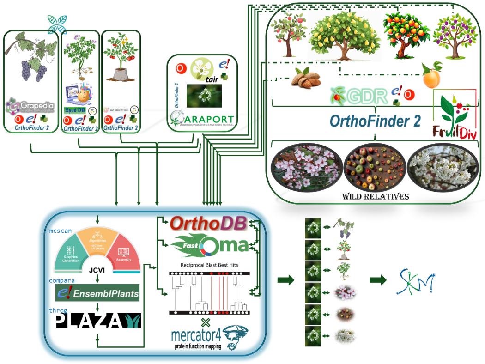
</div> -->


---

## Summary

**Six tools + annotations, one integrated result:**

| Tool | Type | Priority |
|------|------|----------|
| JCVI / MCScanX | Synteny | ★★★★★ |
| Ensembl Compara | Tree-based | ★★★★☆ |
| PLAZA 5.0 | Tree-based, plant-specific | ★★★★☆ |
| OrthoDB / OrthoLoger | Hierarchical OGs | ★★★☆☆ |
| RBH | Sequence similarity | ★★★☆☆ |
| FastOMA | HOG-based, scalable | ★★★☆☆ |

---

## Summary

**Why it matters:**
- FruitDiv needs reliable orthologs to exploit CWR diversity in *Prunus* / *Malus* / *Pyrus*
- ADAPT needs cross-species SKM connections to transfer potato stress knowledge
- Plant polyploidy makes this hard — synteny + consensus approach handles it robustly

> The pipeline is fully scripted in R ([`scripts/skm-tools`](https://github.com/NIB-SI/skm-tools)).
All steps are reproducible.


---

## Summary


---

## Resources & References

<table class="noborder" style="width:100%; table-layout:fixed;"><tr>
<td style="width:50%; vertical-align:top; padding-right:1em; padding-top:0;">
<strong style="display:block; margin-top:0;">Tools</strong>
<ul>
<li>JCVI/MCScanX: github.com/tanghaibao/jcvi</li>
<li>OrthoFinder: github.com/davidemms/OrthoFinder</li>
<li>FastOMA: github.com/DessimozLab/FastOMA</li>
<li>PLAZA: vandepoelelab.be/plaza/</li>
<li>OrthoDB: orthodb.org</li>
<li>Mercator7/MapMan4: plabipd.de/mapman_main.html</li>
</ul>
</td>
<td style="width:50%; vertical-align:top; padding-top:0;">
<strong style="display:block; margin-top:0;">Key Papers</strong>
<ul>
<li>Tang et al. (2024) JCVI. <em>iMeta</em></li>
<li>Majidian et al. (2025) FastOMA. <em>Nature Methods</em></li>
<li>Van Bel et al. (2022) PLAZA 5.0. <em>Nucleic Acids Research</em></li>
<li>Emms & Kelly (2019) OrthoFinder. <em>Genome Biology</em></li>
<li>Tegenfeldt et al. (2025) OrthoDB v12. <em>Nucleic Acids Research</em></li>
</ul>
</td>
</tr></table>


<!-- ---

*End of module · Approaches for Orthology, Annotation, and Cross-Species Comparisons*

**Merge with other modules:**
```bash
cat 01_orthology_annotation.md 02_*.md > main_combined.md
``` -->
