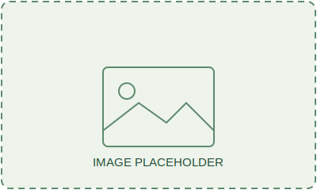
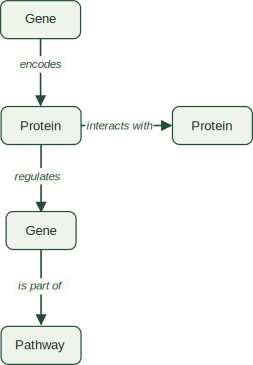
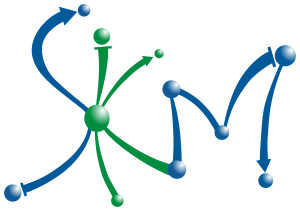

<!-- _class: lead -->

# Knowledge graph approaches for linking datasets to uncover new biological insights

**ECCB 2026 — Tutorial 12: Resources for plant sciences**
Session 3 · 15:30–16:10
Dr. Carissa Bleker, National Institute of Biology, Slovenia

---

## What this session covers

- Why knowledge graphs matter for your work
- What kinds of questions become answerable that weren't before
- A quick tour of the plant KG landscape
- **Hands-on:** querying real plant knowledge graphs yourself
- Where this is heading: natural-language access to graphs

---

## The everyday problem

<div class="columns">

<div>

Data on a gene, pathway, or phenotype is scattered across:

- Pathway databases (KEGG, MetaCyc, AraCyc)
- Interaction resources (STRING)
- Published literature
- Your own omics/phenotyping data

Each is searchable on its own, but **cross-cutting questions** integrating multiple sources of data are the hard part.

</div>

<div>


<!-- *Placeholder: small icon row (KEGG, STRING, a paper, a spreadsheet) showing data scattered across sources* -->

</div>

</div>

---

## What is a knowledge graph?

<style scoped>
.columns {
  grid-template-columns: 1.4fr 0.6fr;
}
</style>

<div class="columns">

<div>
A knowledge graph represents information as:

- **Nodes** — entities (a gene, a protein, a pathway, a phenotype, a paper)
- **Edges** — relationships between entities (*regulates*, *interacts with*, *is part of*)
<!-- - **Properties** — attributes attached to nodes or edges (confidence score, data source, interaction type) -->

</div>

<div>



Together: a traversable source of facts.

</div>

</div>

---

## A concrete example

Much of the important information in biology lives in the *relationships*, not just the entities:

> The **DREB2A** gene `encodes` a transcription factor that `regulates` drought-responsive genes

Represented as **triples**: Subject *predicate* Object

Gene *encodes* Transcription factor
Transcription factor *regulates* Target
ABA *is a* Phytohormone

---

## Why this matters for research

<!-- _footer: "Adapted from the BioCypher Workshop slides (Heidelberg, June 2026), CC-BY 4.0" -->

Once relationships are explicit and typed, you can query *along* them.

Examples:
- Start at a stress phenotype → follow `associated with` → reach a candidate gene → follow `regulates` → get a list of **upstream regulators** to investigate
- Start at a significant locus (e.g. a GWAS hit) → follow `is part of` → reach the genes in that region → follow `interacts with` → narrow down to the most plausible **candidate genes**

These are single, easy-to-state graph queries, not a chain of separate database lookups stitched together manually

---

## A step further: reasoning

<!-- _footer: "Adapted from the BioCypher Workshop slides (Heidelberg, June 2026), CC-BY 4.0" -->

Explicit relationships also let you **infer** new facts, not just retrieve stored ones:

- *Gene A* `confers resistance to` *Powdery mildew*
- *Powdery mildew* `is a` *Fungal disease*
- → Therefore: *Gene A* `confers resistance to` **some** Fungal disease(s)

This is what separates a knowledge graph from a static lookup table — connections you didn't explicitly store can still be derived from the ones you did.

---

## Where this lives: graph databases

<div class="columns">

<div>

- Knowledge graphs are typically stored in a **graph database** (e.g. Neo4j) or as **RDF triples**, rather than rows and columns in a relational table
- Relationships are stored as **first-class objects**, so multi-step connections (gene → pathway → phenotype → condition) can be traversed directly
- Queried with graph-native languages — **Cypher** or **SPARQL** — though you don't always need to write these yourself

</div>

<div>


*A Neo4j graph database showing labelled nodes (`XXX`, `XXX`) and typed edges (`XXX`, `XXX`)*

</div>

</div>

---

## What is an ontology?

<!-- _footer: "Adapted from the BioCypher Workshop slides (Heidelberg, June 2026), CC-BY 4.0" -->

- A controlled vocabulary for a domain: defines classes, subclass relationships, and how entities relate
- Matters in biology because the same thing can be named, grouped, or interpreted differently across datasets
- Example: *"drought tolerance," "water-deficit tolerance,"* and *"drought resistance"* overlap in everyday speech, but aren't necessarily the same defined trait across phenotyping databases — an ontology (e.g. the Plant Trait Ontology) fixes what's meant and how it relates to other traits
- This is what lets a knowledge graph connect entities from different sources consistently

---

## What a knowledge graph adds

<div class="columns">

<div>

A knowledge graph puts all of this in one place, connected, so you can ask questions that span sources:

- *What else is in the neighbourhood of my gene of interest?*
- *Is there existing evidence linking it to this stress response?*
- *Why might pathway A interfere with pathway B's effect?*

This is a shift from **lookup** to **traversal and reasoning**.

</div>

<div>


<!-- *Placeholder: annotated graph highlighting a "gene of interest" node and its neighbours* -->

</div>

</div>

---

## Question types this unlocks

- **Guilt-by-association** — find candidate genes/proteins via their network neighbourhood
- **Mechanism hypotheses** — find paths connecting an observed phenotype to known signalling components
- **Cross-omics contextualisation** — place your experimental hits (transcriptomics, proteomics) onto prior knowledge to see what's already known

These are the questions a single database or a literature search struggles to answer directly.

---

## A few plant knowledge graphs to know

| Resource | Built for | URL |
|---|---|---|
| **AgroLD** <br>  | Broad-scale Semantic Web integration across many crops | [v2.agrold.org/agrold](https://v2.agrold.org/agrold) |
| **KnetMiner** <br>  | Gene-centric candidate discovery, strong GWAS/QTL tie-in | [knetminer.com](https://knetminer.com) |
| **SKM** <br>   | Curated molecular interactions for plant stress signalling + hypothesis generation | [skm.nib.si](https://skm.nib.si) |

<!-- _footer: "This is not an exhaustive list — just three ELIXIR-relevant examples" -->

---

## AgroLD

<div class="columns">

<div>

- Semantic Web / SPARQL-based knowledge graph
- ~1 billion triples, 150+ datasets, 50+ plant species (broad crop coverage)
- Built to support hypothesis formulation and validation across diverse plant species
- Best fit when your question spans **many species or crops** and you're comfortable with SPARQL

[v2.agrold.org/agrold](https://v2.agrold.org/agrold)

</div>

<div>


*Placeholder: screenshot of the AgroLD homepage or Quick Search interface*

</div>

</div>

---

## KnetMiner

<div class="columns">

<div>

- Gene-centric network mining tool
- Evidence-scored search: ranks candidate genes by network support
- Strong integration with GWAS/QTL data
- Best fit when you're starting from a **trait or locus** and need **candidate gene prioritisation**

[knetminer.com](https://knetminer.com)

</div>

<div>


*Placeholder: screenshot of the KnetMiner Plants Lite search/network view*

</div>

</div>

---

## Stress Knowledge Map (SKM)

<div class="columns">

<div>

- Two complementary graphs:
  - **PSS** — curated, mechanistic *P*lant *S*tress *S*ignalling model (800+ _reactions_)
  - **CKN** — *C*omprehensive molecular interaction *k*nowledge *n*etwork (26,000+ molecules, 480,000+ interactions)
- Built by domain experts through systematic literature/database curation
- Best fit for **plant stress biology**, mechanistic hypothesis generation, and quantitative modelling

[skm.nib.si](https://skm.nib.si)

</div>

<div>


*Placeholder: screenshot of the SKM PSS or CKN web app*

</div>

</div>

---

## Let's try them

<!-- _class: hands-on -->

We've seen what each resource is built for — now let's actually use them.

---

## Hands-on: AgroLD

<!-- _class: hands-on -->

<div class="columns">

<div>

Using the browser interface:

- **Quick Search** — keyword search across the whole knowledge base (e.g. a gene name)
- **Advanced Search** — pick an entity type (gene, protein, pathway…) and search within it, results as a sortable/downloadable table
- **SPARQL Query Editor** — comes with ready-made example queries you can run as-is, e.g. *"find all genes involved in the Calvin cycle"* — no need to write SPARQL yourself

[v2.agrold.org/agrold](https://v2.agrold.org/agrold)

</div>

<div>


<!-- *Placeholder: screenshot of the Quick Search or SPARQL Query Editor in action; useful fallback if live demo/wifi has issues* -->

</div>

</div>

---

## Hands-on: KnetMiner (Plants Lite)

<!-- _class: hands-on -->

<div class="columns">

<div>

Using the browser interface. Select the (free) **Plants Lite** resource:

- **Keyword search** — e.g. a trait of interest (*"grain colour"*, *"drought tolerance"*)
- **Gene list / genome region search** — start from your own candidate genes or a genomic interval
- **Network view** — launch the knowledge network for a gene, explore connections, and see the evidence-ranked candidate list

[app.knetminer.com/plants-lite](https://app.knetminer.com/plants-lite)

</div>

<div>


<!-- *Placeholder: screenshot of the KnetMiner network view for a sample gene; useful fallback if live demo/wifi has issues* -->

</div>

</div>

---

## Hands-on: SKM

<!-- _class: hands-on -->

<div class="columns">

<div>

Using the browser interface:

- Search for a gene/protein of interest and explore its neighbourhood interactively
- Visualise and export subnetworks directly from the browser

[skm.nib.si/pss](https://skm.nib.si/pss) OR [skm.nib.si/ckn](https://skm.nib.si/ckn)

This covers most everyday questions. For more targeted, repeatable, or programmatic interrogation, we turn to **skm-tools** next.

</div>

<div>


<!-- *Placeholder: screenshot of a PSS or CKN subnetwork view; useful fallback if live demo/wifi has issues* -->

</div>

</div>

---

## Hands-on: querying SKM yourself

<!-- _class: hands-on -->

We'll now query SKM directly using [**skm-tools**](https://github.com/NIB-SI/skm-tools), a Python toolkit built for the purpose or interrogating PSS and CKN beyond what the web app supports.

Notebook: `placeholder link to notebook on GitHub`

To run: 
**Option A — Google Colab** (no install, runs in browser)
`placeholder link`

**Option B — Local Python**
```
pip install "skm-tools @ git+https://github.com/NIB-SI/skm-tools.git"
```

Note: Visualisation of network analyses results in Cytoscape requires a local Cytoscape install and won't work in Colab.

---

## What we'll do in the notebook

<!-- _class: hands-on -->

<div class="columns">

<div>

1. Load a SKM graph as a NetworkX object
2. Filter to the interactions relevant to our biological question
3. Extract neighbourhoods around genes/components of interest
4. Find paths connecting two parts of the network
5. Visualise the resulting subnetwork

</div>

<div>


<!-- *Placeholder: left-to-right flow diagram of the 5 steps above* -->

</div>

</div>

---

## Case study — [placeholder]

<!-- _class: hands-on -->


---

## The future? Beyond manual querying

<div class="columns">

<div>

What we just worked through required either a developer to have implemented the functionality in a user interface (search interface, API, …), or *you* to write queries/scripts and manually chain results together for any multi-step question.

</div>

<div>


<!-- *Placeholder: flow diagram (question → LLM → graph → answer)* -->

</div>

</div>

---

**Knowledge graphs are a strong foundation for retrieval-augmented generation (RAG)** — letting an LLM do that work instead:

- Selective retrieval of structured content from an external resource
- Answers stay grounded in explicit graph facts, not free-text guessing
- Natural language interaction with the graph's content, while maintaining the traceability of a real query — without anyone having to write one

The goal: the same trustworthy, structured answers, but without a human needing to manually preparing queries and analyses.

---

## Where this fits in the bigger picture

<div class="columns">

<div>

- Knowledge graphs contextualise genes, pathways, and phenotypes within existing knowledge
- They're one route to making sense of large-scale data — including pangenome and variant data

**Next up (Session 4):** building and evaluating plant pangenomes — another way of structuring large-scale plant data for reuse.

</div>

<div>


<!-- *Placeholder: KG & data integration* -->

</div>

</div>

---

## Thank you

<div class="columns">

<div>

**Resources mentioned**
- SKM: [skm.nib.si](https://skm.nib.si), skm-tools: [github.com/NIB-SI/skm-tools](https://github.com/NIB-SI/skm-tools)
- AgroLD: [v2.agrold.org/agrold](https://v2.agrold.org/agrold)
- KnetMiner: [knetminer.com](https://knetminer.com)

Several slides on knowledge graph basics and ontologies adapted from BioCypher Workshop materials (ssciwr/slides-biocypher), CC-BY 4.0

</div>

**Contributors**


<div>

Questions welcome