<!-- _class: lead -->
<!-- _header: "" -->

# Knowledge graph approaches for linking datasets to uncover new biological insights

**ECCB 2026 — Tutorial 12: Resources for plant sciences**
Session 3 · 15:30–16:10
Dr. Carissa Bleker, National Institute of Biology, Slovenia

---

## What this session covers

- Why knowledge graphs matter for your work
- The fundamental ingredients: Graphs and Ontologies
- What kinds of questions become answerable that weren't before
- A quick tour of the plant KG landscape
- **Hands-on:** querying real plant knowledge graphs yourself

---

## The everyday problem

<div class="columns">

<div>

Plant biology data is scattered across resources:

- **Genomic/functional annotation**: TAIR (Arabidopsis), Gramene (comparative plant genomics), Ensembl Plants, ...
- **Traits**: Plant Ontology (PO), Trait Ontology (TO), Planteome, ...
- **Pathways**: AraCyc, KEGG, Gene Ontology (GO), MapMan, ...
- **Interactions:** STRING, Intact, PlantTFDB, miRTarBase, ...
- Published literature
- Your own omics data

Each resource may have its own identifier systems, schema, granularity, ... 

Each is searchable on its own, but **cross-cutting questions** integrating multiple sources of data are difficult. 

How to easily recover indirect biological relationships?

</div>

<div>

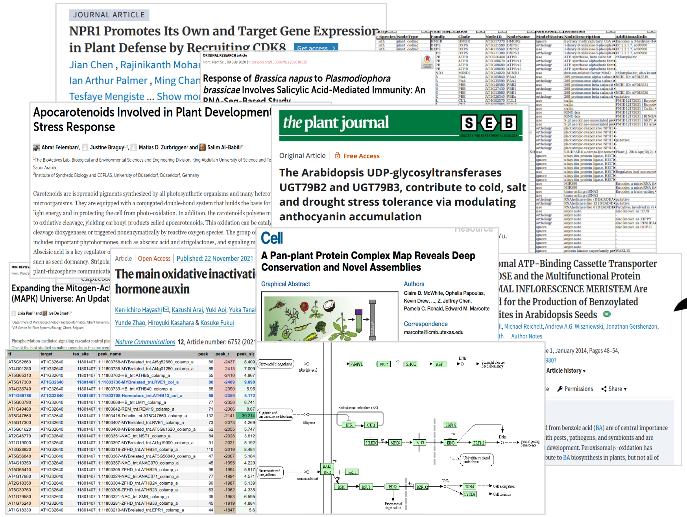
<!-- * (KEGG, STRING, a paper, a spreadsheet) showing data scattered across sources* -->

</div>

</div>

---

## What is a knowledge graph?

<style scoped>
.columns > div:nth-child(1) {
  flex: 1.4;
}
.columns > div:nth-child(2) {
  flex: 0.6;
}
</style>

<div class="columns">

<div>

  A knowledge graph (KG) represents information in a data model of:
  - **Nodes** — entities (a gene, a protein, a pathway, a phenotype, a paper)
  - **Edges** — relationships between entities (*encodes*, *regulates*, *interacts with*, *is part of*)
  - **Properties** — attributes attached to nodes or edges (confidence score, data source, interaction type)


<br>


<div class="aside">

This is the *property graph* definition. An alternative representation are *RDF* (Resource Description Framework) **triples**, in the form of Subject *predicate* Object. E.g. <br> `FT` `interacts_with` `FD`. <br> In RDF, each element becomes a globally unique **URI** pointing to a shared, external identifier system: 
```uniprot:Q9SXZ2 ro:RO_0002434 uniprot:Q84JK2```
(here using CURIEs prefixes for readability)

</div>

</div>

<div>

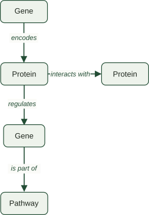

Together: a traversable source of facts.

</div>

</div>

---


## A concrete example

Much of the important information in biology lives in the *relationships*, not just the entities. For example, the sentence:

> The **DREB2A** gene `encodes` a transcription factor that `regulates` drought-responsive genes

Can be represented as **triples**: Subject *predicate* Object

* DREB2A (`gene`) *encodes* Transcription factor (`protein`)
* Transcription factor (`protein`) *regulates* Drought response (`pathway`)

---

## Why this matters for research

Once relationships are explicit and typed, you can query *along* them.

Examples:
- Start at a stress phenotype → follow `associated with` → reach a candidate gene → follow `regulates` → get a list of **upstream regulators** to investigate
- Start at a significant locus (e.g. a GWAS hit) → follow `is part of` → reach the genes in that region → follow `interacts with` → narrow down to the most plausible **candidate genes**

These are single, easy-to-state graph queries, not a chain of separate database lookups stitched together.

---

## A step further: reasoning

Explicit relationships also let you **infer** new facts, not just retrieve stored ones:

- *Gene A* `confers resistance to` *Powdery mildew*
- *Powdery mildew* `is a` *Fungal disease*
- → Therefore: *Gene A* `confers resistance to` **some** Fungal disease(s)

This is what separates a knowledge graph from a static lookup table — connections not explicitly stored can be derived from the ones that are.

<div class="aside">

**A necessary caveat: not all edges are equal**

Not every relationship in a knowledge graph carries the same confidence:

- A curated, experimentally validated interaction ≠ a text-mined or computationally predicted one
- If reasoning chains through an uncertain edge, the conclusion inherits that uncertainty — silently, unless the graph tracks it
- Uncertainty should be modelled explicitly as **evidence**, **confidence**, or **provenance**.

</div>

---

## Schemas and ontology...

**To connect data, graphs need a shared language.**

- A controlled vocabulary for a domain: defines classes, subclass relationships, and how entities relate
- Matters in biology because the same thing can be named, grouped, or interpreted differently across datasets
- Example: *"drought tolerance," "water-deficit tolerance,"* and *"drought resistance"* overlap in everyday speech, but aren't necessarily the same defined trait across phenotyping databases

<div class="aside">

An <strong>ontology</strong> (e.g., the Plant Trait Ontology) is a semantic data model that defines the concepts of a domain — the classes of things that exist, how they relate, and the properties that describe them. Ontologies are shared, reusable vocabularies, allowing entities from different sources be mapped onto the same concepts.

</div>
<br>
<div class="aside">

A <strong>schema</strong> constrains the structure of a specific graph: which node and edge types are permitted, and how they may connect. For example, a schema might specify that a *gene* node can have an *encodes* edge to a *protein* node, but not to a *pathway* node. A schema will often use ontology classes as its node and relationship types

</div>

---

## Where this lives: graph databases

<div class="columns">

<div>

- Knowledge graphs are typically stored in a **graph database** (e.g. Neo4j) or as **RDF triples**, rather than rows and columns in a relational table
- Relationships are stored as **first-class objects**, so multi-step connections (gene → pathway → phenotype → condition) can be traversed directly
- Queried with graph-native languages: **Cypher** or **SPARQL** (you don't always need to write these yourself!)

</div>

<div>

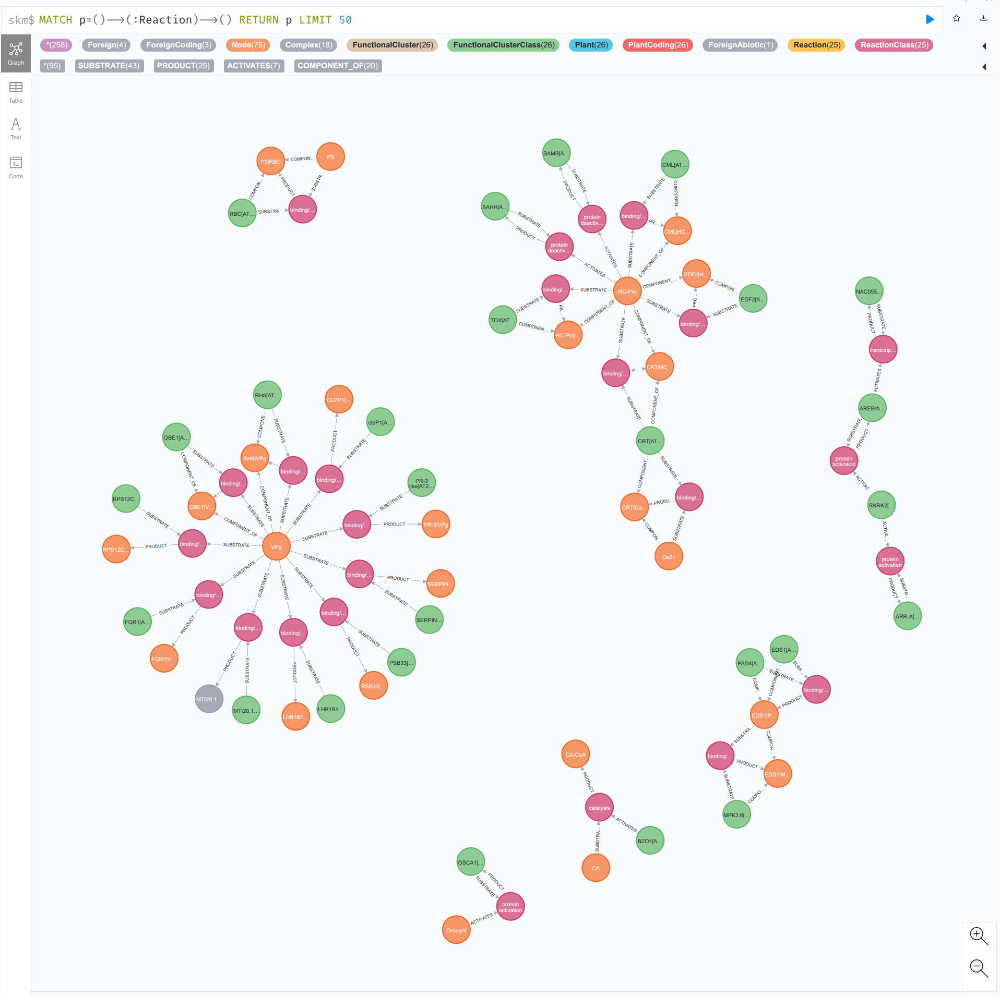
*A Neo4j graph database showing labelled nodes and typed edges*

</div>

</div>

---

## What a knowledge graph adds:

<div class="columns">

<div>

A knowledge graph puts all of this in one place, connected, so you can ask questions that span sources:

- *What else is in the neighbourhood of my gene of interest?*
- *Is there existing evidence linking it to this stress response?*
- *Why might pathway A interfere with pathway B's effect?*

This is a shift from **lookup** to **traversal and reasoning**.

</div>

<div class="img-col">

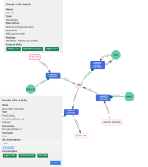
*Reactions and node properties from Stress Knowledge Map*

</div>

</div>

---

## Question types this unlocks

<div class="columns">

<div>

- **Guilt-by-association** — find candidate genes/proteins via their network neighbourhood
- **Mechanism hypotheses** — find paths connecting an observed phenotype to known signalling components
- **-Omics contextualisation** — place your experimental data (transcriptomics, proteomics, metabolomics... ) within prior knowledge
- **And on...** — gap-finding, conflict detection, cross-species comparison...

These are the questions a single database might struggle to answer directly.

</div>

<div class="img-col">


*Reactions and node properties from Stress Knowledge Map*

</div>

</div>

---

## Beyond manual querying

<div class="columns">

<div>

Answering these questions often require either a developer to build a tool/interface, or for *you* to write database queries.

**Knowledge graphs are a strong foundation for retrieval-augmented generation (GraphRAG)** — letting an LLM do that work instead:

- Provides assistance for retrieval of structured content from a resource. 
- LLM answers can be grounded in explicit graph facts, preserving provenance and reducing hallucination. 
- Increases accessibility to complex datasets by allowing natural language interaction.

</div>

<div class="img-col">

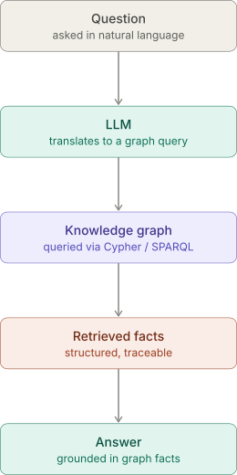
*GraphRAG*

</div>

</div>

---

## The plant knowledge graph landscape

| Resource | Built for | URL |
|---|---|---|
|  | Broad-scale Semantic Web integration across many crops | [http://agrold.org](http://agrold.org) |
|  | Gene-centric candidate discovery, strong GWAS/QTL tie-in | [knetminer.com](https://knetminer.com) |
| 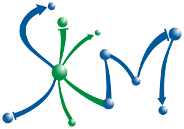 **Stress Knowledge Map** | Curated molecular interactions for plant stress signalling + hypothesis generation | [skm.nib.si](https://skm.nib.si) |
| **PlantMetWiki** | RDF-based linked data for plant metabolic pathways, built from PlantCyc across 500+ species | [plantmetwiki.bioinformatics.nl](https://plantmetwiki.bioinformatics.nl/) |
| **TomTom** | Tomato-focused KG integrating databases for multi-stress gene regulatory network analysis | [github.com/Plant-Net/TomTom](https://github.com/Plant-Net/TomTom) |
| **PlantConnectome** | LLM-mined KG from 71,000+ plant biology abstracts, includes genes, molecules, stresses, ... | [plant.connectome.tools](https://plant.connectome.tools/) |
| **PlantGraph** | Large-scale Arabidopsis KG with natural-language querying | [plantgraph.se](https://plantgraph.se/) |
| **Plant Reactome** | Curated rice reference pathways projected to 130+ plant species via orthology (Gramene project) | [plantreactome.gramene.org](https://plantreactome.gramene.org/index.php?option=com_content&view=article&id=45&Itemid=290&lang=en) |


*Lost? FAIDARE (FAIR Data-finder for Agronomic REsearch) indexes AgroLD, KnetMiner, SKM and 30+ other plant databases (genotyping, phenotyping, germplasm) through a common interface ([urgi.versailles.inrae.fr/faidare](https://urgi.versailles.inrae.fr/faidare/))!*

<!-- _footer: "Not an exhaustive list. First three are ELIXIR services" -->

---

## AgroLD

<div class="columns">

<div>

- Semantic Web / SPARQL-based knowledge graph
- ~1 billion triples, 150+ datasets, 50+ plant species (broad crop coverage)
- Built to support hypothesis formulation and validation across diverse plant species
- Best fit when your question spans **many species or crops** and you're comfortable with SPARQL

<br>

<br>

<br>

[http://agrold.org](http://agrold.org)

</div>

<div class="img-col">

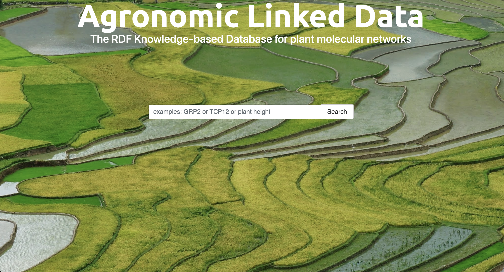
*Screenshot of the AgroLD homepage*

</div>

</div>

---

## HOWTO: AgroLD

<!-- _class: hands-on -->
<!-- _header: "[http://agrold.org](http://agrold.org)" -->

<div class="columns">

<div>

Using the browser interface:

- **Quick Search** — keyword search across the whole knowledge base (e.g., drought resistance)
- **Advanced Search** — pick an entity type and search within it
- **SPARQL Query Editor** — comes with ready-made example queries you can run as-is

[http://agrold.org](http://agrold.org)

</div>

<div class="img-col">

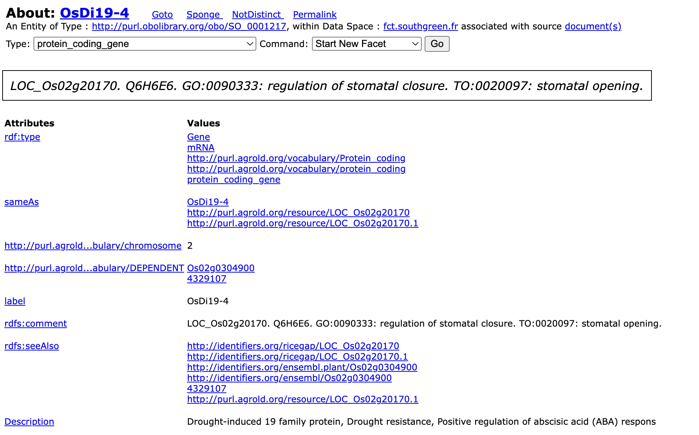

</div>

</div>

---

## KnetMiner

<div class="columns">

<div>

- Gene-centric network mining tool
- Evidence-scored search: ranks candidate genes by network support
- Strong integration with GWAS/QTL data
- Best fit when you're starting from a **trait or locus** and need **candidate gene prioritisation**

<br>

<br>

<br>

[knetminer.com](https://knetminer.com)

</div>

<div class="img-col">

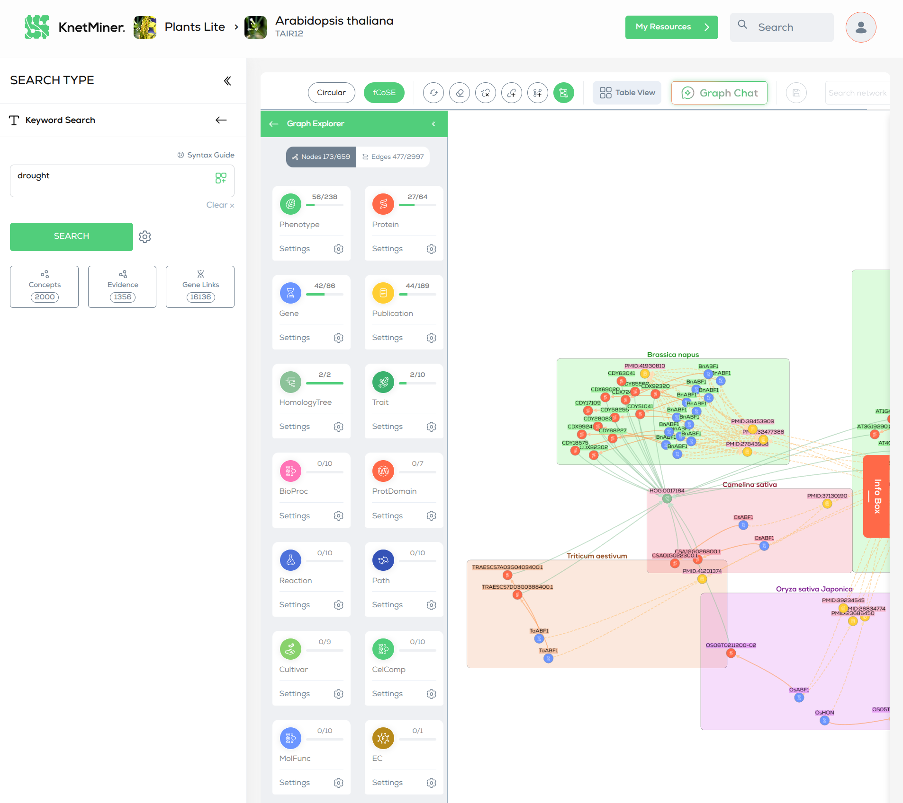
*KnetMiner Plants Lite network view*

</div>

</div>

---

## HOWTO: KnetMiner (Plants Lite)

<!-- _class: hands-on -->
<!-- _header: "[app.knetminer.com/plants-lite](https://app.knetminer.com/plants-lite)" -->

<div class="columns">

<div>

Using the browser interface. Select the (free) **Plants Lite** resource:

- **Keyword search** — e.g. a trait of interest (*"grain colour"*, *"drought tolerance"*)
- **Gene list / genome region search** — start from your own candidate genes or a genomic interval
- **Network view** — launch the knowledge network for a gene, explore connections, and see the evidence-ranked candidate list

<br>

<br>

<br>

<br>

[app.knetminer.com/plants-lite](https://app.knetminer.com/plants-lite)

</div>

<div  class="img-col">


*KnetMiner Plants Lite network view*

</div>

</div>

---

## Worked Example: Grain Colour & Pre-Harvest Sprouting (PHS)

<!-- _class: hands-on -->
<!-- _header: "[app.knetminer.com/plants-lite](https://app.knetminer.com/plants-lite)" -->

<style scoped>
  section p, li, td {
    font-size:18px;
  }
</style>

Start from a **wheat gene list** and the traits *"grain colour and pre-harvest sprouting"*:
- **Trait dissection** — KnetMiner breaks the trait into sub-components (seed dormancy, testa pigmentation, ABA signalling) rather than treating it as one keyword
- **Semantic motif search** — runs 180+ pre-defined motif queries per gene, scoring each for evidence linking it to grain colour, dormancy, and sprouting resistance
- **Interactive gene–trait network** — builds a knowledge graph connecting genes, QTLs, publications, and ontology terms, ranked by evidence
- **Graph Chat** — ask follow-up questions in natural language (*"which of these genes also affect root architecture?"*); the agent reasons directly over the constructed KG, not just text

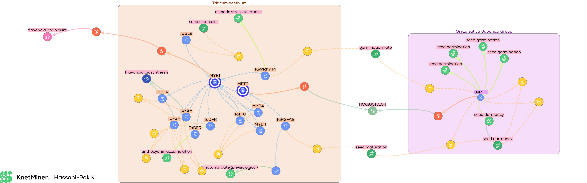

---

## Stress Knowledge Map (SKM)


<div class="columns">

<div>

- Two complementary graphs:
  - **PSS** — curated, mechanistic *P*lant *S*tress *S*ignalling model (800+ _reactions_)
  - **CKN** — *C*omprehensive molecular interaction *k*nowledge *n*etwork (480,000+ interactions)
- Built by domain experts through systematic literature/database curation
- Best fit for **plant stress biology**, mechanistic hypothesis generation, and quantitative modelling

<br>

<br>

<br> 

[skm.nib.si](https://skm.nib.si)

</div>

<div class="img-col">

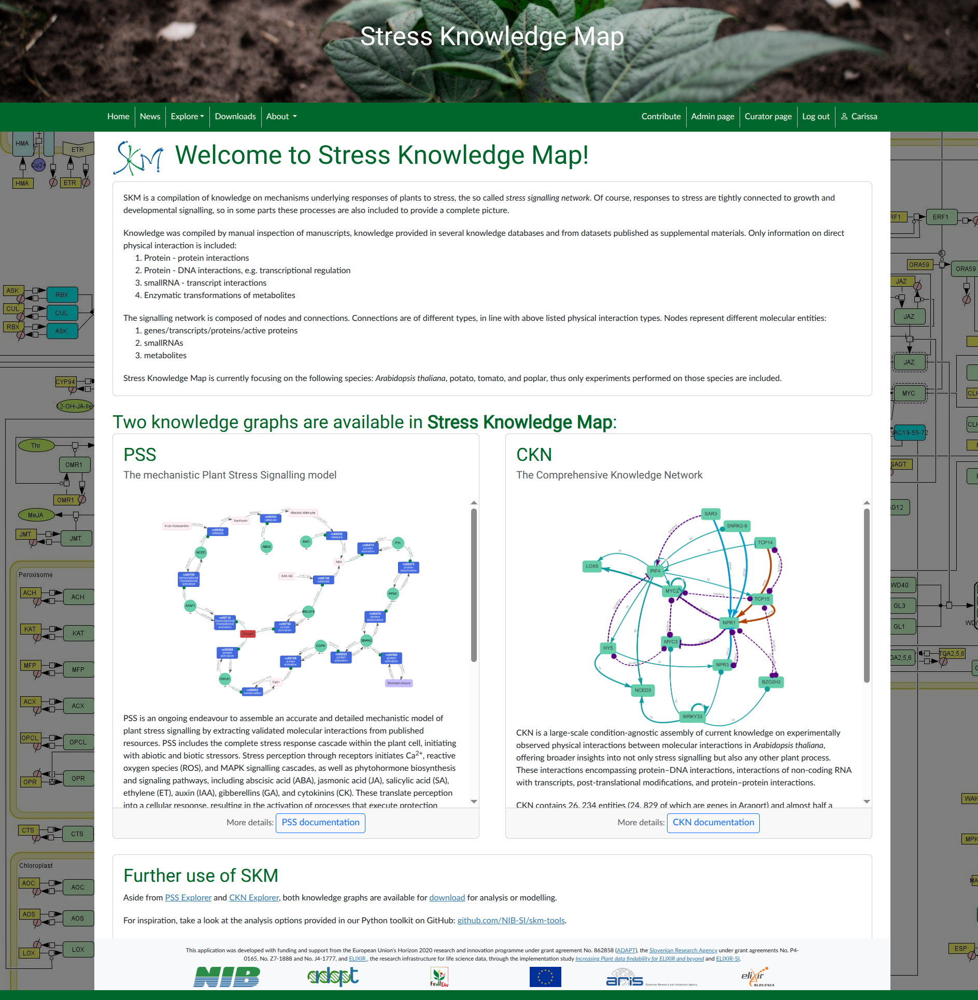
*SKM home page*

</div>

</div>

---

## HOWTO: SKM

<!-- _class: hands-on -->
<!-- _header: "[skm.nib.si](https://skm.nib.si)" -->

<div class="columns">

<div>

Using the browser interface:

- **Gene search** — Search for a gene of interest and explore its neighbourhood or the paths between multiple entities 

   [skm.nib.si/pss](https://skm.nib.si/pss) OR [skm.nib.si/ckn](https://skm.nib.si/ckn)

   Visualise and export subnetworks directly from the browser

- **Download** — Export the full PSS or CKN graph in standard formats (SIF, CSV) for offline analysis

- [**skm-tools**](https://github.com/NIB-SI/skm-tools) — A Python toolkit for network analysis in PSS and CKN for more targeted, repeatable, or programmatic analyses 

</div>

<div>

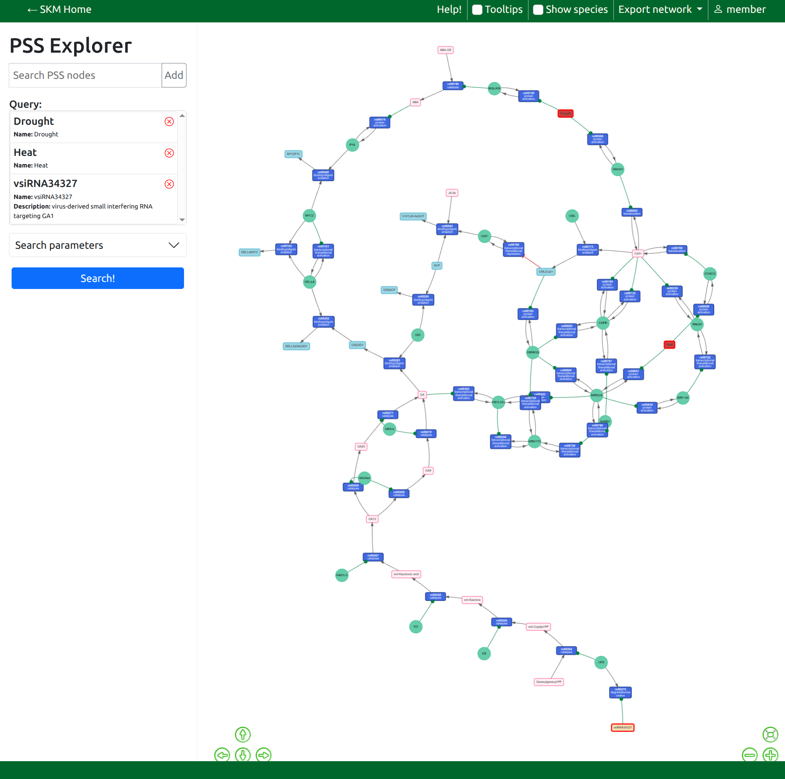
*SKM PSS Explorer*

</div>

</div>

---

## SKM case studies

<!-- _class: hands-on -->


- Bleker et al. (2024) *Plant communications.* [doi:10.1016/j.xplc.2024.100920](https://doi.org/10.1016/j.xplc.2024.100920)
- Žnidarič et al (2025) *Plant Direct* [doi:10.1002/pld3.70035](https://doi.org/10.1002/pld3.70035)


---

## Making your own knowledge graph with BioCypher

<div class="columns">

<div class="img-col">


*BioCypher architecture*

</div>

<div style="align-self:center;">

- [biocypher.org](https://biocypher.org) is a framework for building knowledge graphs from heterogeneous biological data sources
<!-- - https://github.com/biocypher/biocypher-cookiecutter-template -->
- [biocypher-cookiecutter-template](https://github.com/biocypher/biocypher-cookiecutter-template) is a ready-to-use template for building your own KG
- BioCypher: Lobentanzer et al. (2023) *Nature Biotechnology.* [doi:10.1038/s41587-023-01848-y](https://doi.org/10.1038/s41587-023-01848-y)

</div>

---

## Where this fits in the bigger picture

<div class="columns">

<div>

- Knowledge graphs integrate and contextualise genes, pathways, and phenotypes within existing knowledge
- They're one route to making sense of large-scale data, including pangenome and variant data (*Session 4*)
- They can be used to generate hypotheses, prioritise candidates, and guide experimental design

### Beyond traversal
- **Graph algorithms** such as shortest paths, centrality, community detection, ... for identifying hubs or clusters
- **Knowledge graph embeddings** to learn a vector representation of every node and/or edge, for node prioritisation or link prediction
- **Graph neural networks (GNNs)**: combine graph structure with node features (e.g. expression data) for tasks like gene-function prediction

</div>

</div>

---

## Hands on

<!-- _class: hands-on -->

<div class="columns">

<div class="aside">

**AgroLD**: 

[http://agrold.org](http://agrold.org)


- Quick Search (keyword)
- Advanced Search (by entity type)
- SPARQL Query Editor (example queries)


</div>


<div class="aside">

**KnetMiner**: 

[app.knetminer.com/plants-lite](https://app.knetminer.com/plants-lite)

- Keyword search (trait)
- Gene list / genome region search
- Network view (evidence-ranked candidates)


</div>

<div class="aside">

**Stress Knowledge Map**: 

[skm.nib.si](https://skm.nib.si)

- Gene search (PSS / CKN explorer)
- Download (SIF, CSV)
- Try skm-tools in Colab at [tinyurl.com/skm-quickstart](https://tinyurl.com/skm-quickstart)


</div>

</div>
<br>
<div style="text-align:center;">

Join the **plant-kgs** channel in BioCypher: 

*https://biocypher.zulipchat.com/join/5xx7fnbwokgpqdt4cr273sdf/*

</div>


---

## Thank you

<div class="columns">

<div>

**Slides available at** [github.com/NIB-SI/ECCB2026_T12](https://github.com/NIB-SI/ECCB2026_T12)

</div>

<div>

**Contributors**
- Keywan Hassani-Pak (*KnetMiner*)
- Pierre Larmande (*AgroLD*)

- Several slides on knowledge graph basics adapted from BioCypher Workshop materials (Heidelberg, June 2026): [github.com/ssciwr/slides-biocypher](https://github.com/ssciwr/slides-biocypher), CC-BY 4.0

</div>

</div>

<br><br><br><br>

**Questions welcome!**

